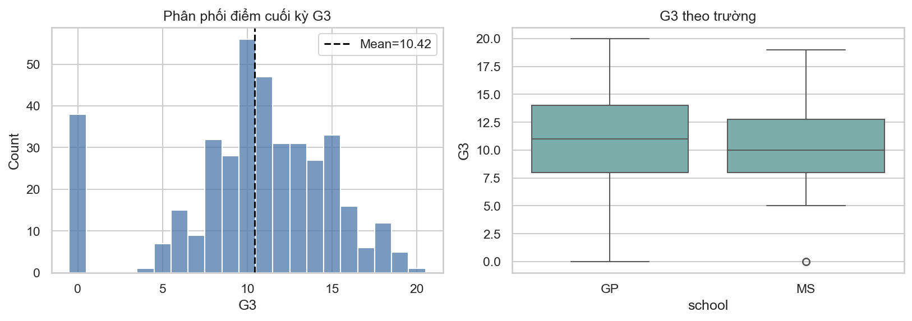
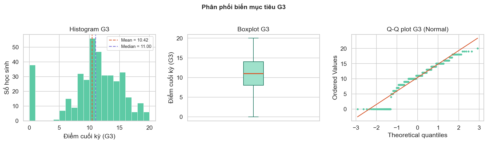
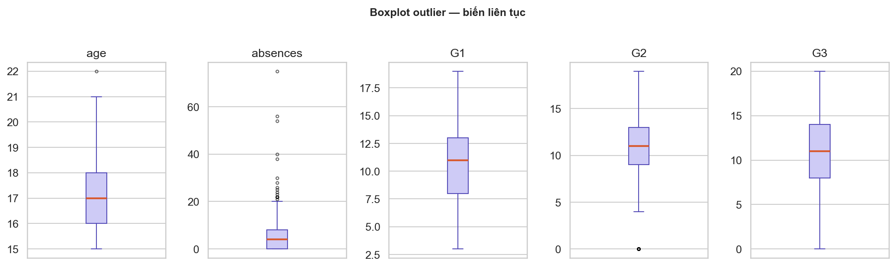

# PHẦN I — TỔNG QUAN VÀ PIPELINE TỔNG THỂ CỦA PROJECT

> **Học phần:** IT2022E — Thống kê ứng dụng và Quy hoạch thực nghiệm
> **Đề tài:** Phân tích thống kê các yếu tố liên quan đến kết quả học tập và đề xuất quy hoạch
> thực nghiệm hỗ trợ học sinh.
>
> File này là **tài liệu nền (tiền đề)** cho toàn bộ báo cáo: nó thiết lập bối cảnh, mục tiêu,
> dữ liệu, nguyên tắc phân tích và **pipeline tổng thể**. Các file nội dung chi tiết tiếp theo
> (mô tả dữ liệu, suy luận thống kê, hồi quy, quy hoạch thực nghiệm…) sẽ kế thừa khung và các
> quy ước được định nghĩa ở đây. Khung dàn ý đầy đủ nằm ở [`report/OUTLINE.md`](../OUTLINE.md).

---

## 1. Giới thiệu

### 1.1. Bối cảnh

Kết quả học tập của một học sinh chịu ảnh hưởng đồng thời của nhiều yếu tố: đặc điểm cá nhân,
hoàn cảnh gia đình, hành vi học tập, môi trường nhà trường và cả những yếu tố tiềm ẩn khó đo
lường. Việc phân tích dữ liệu học tập giúp **mô tả** các nhóm học sinh, **nhận diện** những
biến có liên hệ với kết quả cuối kỳ và **xây dựng giả thuyết** cho các chương trình hỗ trợ
trong tương lai.

Tuy nhiên, phần lớn dữ liệu giáo dục mang tính **quan sát** chứ không đến từ thí nghiệm có
kiểm soát. Vì thế, một quy trình thống kê nghiêm túc phải phân biệt rõ ba khái niệm khác nhau:

- **Mối liên hệ (association)** — hai biến cùng biến thiên trong dữ liệu.
- **Khả năng dự báo (prediction)** — dùng biến này để đoán biến kia ngoài mẫu.
- **Tác động nhân quả (causation)** — thay đổi biến này *làm* biến kia thay đổi.

Project áp dụng đầy đủ các nội dung cốt lõi của học phần — thu thập và chuẩn bị dữ liệu, thống
kê mô tả, ước lượng và khoảng tin cậy, kiểm định giả thuyết, tương quan, hồi quy và quy hoạch
thực nghiệm — trên một bộ dữ liệu thực, với toàn bộ quy trình **có thể tái lập** bằng Python.

### 1.2. Vấn đề nghiên cứu

Trọng tâm là **điểm cuối kỳ môn Toán `G3`** (thang 0–20) của học sinh trung học. Project trả
lời: những yếu tố nào *liên quan* đến `G3`, mô hình tuyến tính *dự báo* `G3` đến đâu, và *nếu
muốn kết luận nhân quả* về một chương trình hỗ trợ thì phải **thiết kế thí nghiệm** ra sao.

---

## 2. Mục tiêu nghiên cứu

Project có bốn mục tiêu, sắp xếp theo đúng mạch của một quy trình thống kê ứng dụng:

1. **Mô tả** bộ dữ liệu và phân phối điểm cuối kỳ `G3`.
2. **Đánh giá mối liên hệ** giữa `G3` với một số đặc điểm cá nhân, gia đình và hành vi học tập.
3. **So sánh khả năng giải thích và dự báo** `G3` của mô hình **không** sử dụng và **có** sử
   dụng điểm quá trình `G1`, `G2`.
4. **Đề xuất một quy hoạch thực nghiệm** để đánh giá một chương trình hỗ trợ học tập trong
   tương lai.

---

## 3. Câu hỏi nghiên cứu

Bốn câu hỏi nghiên cứu ánh xạ trực tiếp với bốn mục tiêu:

| # | Câu hỏi nghiên cứu | Mục tiêu | Phần xử lý |
|---|---|:---:|---|
| Q1 | Phân phối `G3` và đặc điểm của mẫu học sinh như thế nào? | 1 | EDA, thống kê mô tả |
| Q2 | `G3` có liên hệ với `higher`, `failures`, `studytime`, `Walc`, trình độ học vấn cha mẹ và các biến nền khác không? | 2 | Kiểm định giả thuyết, CI |
| Q3 | Biến nền/hành vi có đủ để dự báo sớm `G3` không? Thêm `G1`, `G2` thay đổi hiệu năng thế nào? | 3 | Tương quan, hồi quy, cross-validation |
| Q4 | Một thí nghiệm đánh giá chương trình hỗ trợ nên có treatment, randomization, replication, blocking và cỡ mẫu ra sao? | 4 | Quy hoạch thực nghiệm (DoE) |

---

## 4. Bộ dữ liệu

### 4.1. Nguồn và đơn vị quan sát

- **Nguồn:** Student Performance Dataset — UCI Machine Learning Repository (Cortez & Silva,
  2008).
- **Tệp gốc:** [`data/raw/student-mat.csv`](../../data/raw/student-mat.csv), định dạng phân
  tách bằng dấu chấm phẩy (`;`). **Read-only** — không bao giờ chỉnh sửa.
- **Đơn vị quan sát:** một học sinh học **môn Toán** tại một trong hai trường trung học ở Bồ
  Đào Nha — Gabriel Pereira (`GP`) hoặc Mousinho da Silveira (`MS`).
- **Biến kết quả (response):** `G3` — điểm cuối kỳ, thang **0–20**.

> Project **chỉ** dùng dataset môn Toán (`student-mat.csv`). Dataset môn Tiếng Bồ Đào Nha
> không được ghép vào vì có học sinh xuất hiện ở cả hai tập, cần một thiết kế liên kết dữ liệu
> riêng (quyết định D-001).

### 4.2. Kích thước và chất lượng

| Thuộc tính | Giá trị |
|---|---:|
| Số quan sát (học sinh) | **395** |
| Số biến | **33** |
| Giá trị thiếu (missing) | 0 |
| Dòng trùng lặp (duplicate) | 0 |
| Trường GP / MS | 349 / 46 |
| Nữ / Nam | 208 / 187 |



**Hình 1.** Tổng quan biến kết quả `G3` — phân phối điểm cuối kỳ (trái) và so sánh giữa hai
trường GP/MS (phải).

### 4.3. Phân loại biến

Việc phân loại theo bản chất đo lường quyết định **phương pháp thống kê được phép dùng**. Toàn
bộ 33 biến được chia thành 4 nhóm:

| Loại | Số biến | Danh sách | Cách diễn giải |
|---|:---:|---|---|
| **Định danh** (gồm nhị phân yes/no) | 17 | `school`, `sex`, `address`, `famsize`, `Pstatus`, `Mjob`, `Fjob`, `reason`, `guardian`, `schoolsup`, `famsup`, `paid`, `activities`, `nursery`, `higher`, `internet`, `romantic` | Các nhóm **không có thứ tự** |
| **Thứ bậc (ordinal)** | 11 | `Medu`, `Fedu`, `traveltime`, `studytime`, `failures`, `famrel`, `freetime`, `goout`, `Dalc`, `Walc`, `health` | Có thứ tự nhưng khoảng cách **chưa chắc bằng nhau** |
| **Đếm (count)** | 2 | `age`, `absences` | Số lần / số ngày |
| **Điểm số (score)** | 3 | `G1`, `G2`, `G3` | Điểm trên thang 0–20 |

**Hai lưu ý quan trọng về thang đo:**

- `studytime=4` **không** có nghĩa là học gấp đôi `studytime=2` — đây là các khoảng thời gian
  đã được mã hóa. Do đó, mọi mô hình coi biến thứ bậc là số liên tục đều phải được **diễn giải
  thận trọng**.
- `failures` (0–3) về bản chất là **biến đếm**, nhưng trong kiểm định giả thuyết được xử lý như
  **biến thứ bậc nhiều mức** (dùng Kruskal–Wallis), vì số mức ít và phân bố rất lệch.

### 4.4. Đặc điểm cần ghi nhớ (ảnh hưởng trực tiếp đến phương pháp)

- **Point mass tại 0:** có **38 học sinh `G3=0` (9,62%)**. `G3=0` là giá trị **hợp lệ** theo
  data dictionary (thang 0–20) nên được **giữ** trong phân tích chính. Phân phối vì vậy không
  gần chuẩn (skew ≈ −0,73).
- **Phân bố `failures` rất lệch:** `{0: 312, 1: 50, 2: 17, 3: 16}` — phần lớn học sinh chưa
  từng trượt môn.
- **Nhóm mất cân bằng nghiêm trọng:** `higher=yes` có 375 học sinh, `higher=no` chỉ **20**.
  Điều này khiến khoảng tin cậy của contrast `higher` rất rộng và hạn chế khái quát hóa.
- **`absences` có đuôi phải dài** (max 75). Dữ liệu chính **không** winsorize/loại bỏ; chỉ
  kiểm tra winsorization như sensitivity.



**Hình 2.** Phân phối `G3` trên toàn mẫu (histogram, boxplot, Q-Q). Điểm khối tại 0 và đuôi
lệch khiến phân phối không gần chuẩn.



**Hình 3.** Boxplot các biến liên tục — `absences` có đuôi phải dài; các giá trị lớn được giữ
nguyên trong dataset chính (không winsorize).

---

## 5. Nguyên tắc phân tích xuyên suốt

Mọi notebook và mọi mục báo cáo đều tuân thủ ba nguyên tắc nền tảng:

1. **Association ≠ Causation.** Dữ liệu là **quan sát**, không phải thí nghiệm ngẫu nhiên. Mọi
   kết quả từ EDA, kiểm định và hồi quy đều mô tả **mối liên hệ**, không được trình bày như
   tác động nhân quả (D-009, D-012).
2. **Ý nghĩa thống kê ≠ ý nghĩa thực tiễn.** Luôn báo cáo **effect size** và **khoảng tin cậy**
   bên cạnh p-value. Một kết quả có ý nghĩa thống kê nhưng effect nhỏ có thể không quan trọng
   trong thực tế, và ngược lại (D-006, D-008).
3. **Đa kiểm định phải hiệu chỉnh.** Khi chạy nhiều kiểm định, kết luận xác nhận dựa trên
   **Holm-adjusted p-value** (hoặc joint test trong hồi quy), không dựa trên p-value thô
   (D-005).

**Các quyết định dữ liệu đã chốt** (chi tiết trong [`.docs/DECISIONS.md`](../../.docs/DECISIONS.md)):

| Mã | Quyết định |
|---|---|
| D-002 | `data/raw/` là read-only; mọi output ghi vào `data/processed/`. |
| D-003 | **Giữ `G3=0`** trong phân tích chính; chỉ xét `G3>0` như sensitivity. |
| D-004 | **Không** loại/winsorize `absences` trong dataset chính. |
| D-005 | Welch t-test / Kruskal–Wallis / Spearman + **Holm correction** cho 10 giả thuyết chính; Dunn post-hoc sau Kruskal–Wallis. |
| D-007 | H9 (`absences` ↔ `G3`) là giả thuyết **post-hoc/exploratory**, luôn gắn nhãn. |
| D-016 | Effect trong mô phỏng DoE **đặt trước theo ý nghĩa thực tiễn**, không sao chép từ chênh lệch quan sát. |

**Hằng số dùng chung toàn project:**

```
RANDOM_SEED = 42      # mọi bước ngẫu nhiên (CV split, bootstrap, mô phỏng)
ALPHA       = 0.05    # mức ý nghĩa, kiểm định hai phía
N_BOOTSTRAP = 5000    # số lần lặp bootstrap
```

---

## 6. Pipeline tổng thể

### 6.1. Sơ đồ luồng dữ liệu

```
┌─────────────────────────────────────────────────────────────────────────┐
│  data/raw/student-mat.csv        (;-separated, 395 × 33, READ-ONLY)      │
└─────────────────────────────────────────────────────────────────────────┘
        │
        │  NB 01: đọc → kiểm tra chất lượng (missing, duplicate, range)
        │          → phân loại biến → xuất NGUYÊN TRẠNG
        ▼
┌─────────────────────────────────────────────────────────────────────────┐
│  data/processed/student_mat_clean.csv            (395 × 33)              │
│  (giữ G3=0, giữ absences gốc — KHÔNG biến đổi dữ liệu)                   │
└─────────────────────────────────────────────────────────────────────────┘
        │
        │  Tất cả các notebook phân tích cùng NẠP file này:
        │  • Luồng CORE:     NB 02, 03, 05
        │  • Luồng APPENDIX: NB 01, 02, 03, 04
        ▼
┌──────────────────────────────┐     ┌──────────────────────────────────┐
│  data/processed/*.csv         │     │  report/figures/*.png             │
│  (bảng kết quả: inference,    │     │  (29 hình: eda_, hyp_, ci_,       │
│   CI, regression, DoE…)       │     │   reg_, doe_)                     │
└──────────────────────────────┘     └──────────────────────────────────┘
        │                                       │
        └───────────────────┬───────────────────┘
                            ▼
        ┌───────────────────────────────────────────────┐
        │  report/results/  (báo cáo + các file chi tiết) │
        └───────────────────────────────────────────────┘
```

> **Lưu ý mấu chốt về cái tên `_clean`:** hậu tố `_clean` **chỉ nghĩa là "đã chuẩn hóa định
> dạng"** (đổi separator `;` → `,` để các phase sau dùng thuận tiện). Notebook 01 **cố ý
> không làm sạch** theo nghĩa biến đổi dữ liệu: nó **giữ nguyên** `G3=0` và `absences` gốc. Đây
> là điểm dễ hiểu nhầm nhất của pipeline.

### 6.2. Các giai đoạn

| Giai đoạn | Đầu vào | Xử lý chính | Đầu ra |
|---|---|---|---|
| **1. Chuẩn bị & EDA** | `student-mat.csv` | Kiểm tra chất lượng, phân loại biến, mô tả `G3`, khám phá liên hệ | `student_mat_clean.csv`, hình `eda_*` |
| **2. Suy luận thống kê** | `student_mat_clean.csv` | CI cho trung bình; kiểm định H1–H9 + Holm; Dunn post-hoc | hình `hyp_*`, bảng inference/posthoc |
| **3. CI & độ nhạy** | `student_mat_clean.csv` | Bootstrap percentile/BCa; MDE @ power 80% | hình `ci_*`, bảng CI/power |
| **4. Tương quan & hồi quy** | `student_mat_clean.csv` | Model A vs B; 5-fold CV; HC3; diagnostics | hình `reg_*`, bảng regression |
| **5. Quy hoạch thực nghiệm** | (dùng SD của `G3`) | Cỡ mẫu, Monte Carlo power, factorial 2×2 | hình `doe_*`, bảng DoE |

### 6.3. Hai luồng notebook

Project duy trì **hai luồng song song** trên cùng một dữ liệu — đây là điểm cấu trúc cần nắm
trước khi đọc bất kỳ notebook nào:

| | **Luồng CORE** | **Luồng APPENDIX** |
|---|---|---|
| **Thư mục** | `notebooks/core/` | `notebooks/` |
| **Vai trò** | Mạch **trình bày** chính, bám đề cương — gọn, đủ ý | **Phụ lục kỹ thuật** — đầy đủ, kiểm chứng độ bền vững |
| **Notebook** | `01`, `02`, `03`, `05` | `01_EDA`, `02_hypothesis_testing`, `03_confidence_intervals`, `04_regression` |
| **Kỹ thuật nâng cao** | Phiên bản cơ bản | Holm, Dunn, bootstrap BCa, 5-fold CV, HC3, sensitivity analysis |

**Ánh xạ luồng CORE với học phần** (quyết định D-015):

| Notebook core | Chương / CLO | Nội dung |
|---|---|---|
| `01_data_preparation_and_eda.ipynb` | Chương 1, 6 | Thu thập, chuẩn bị, mô tả dữ liệu |
| `02_statistical_inference.ipynb` | Chương 4.1–4.5 | Ước lượng, khoảng tin cậy, kiểm định |
| `03_correlation_and_regression.ipynb` | Chương 4.6 | Tương quan và hồi quy tuyến tính |
| `05_experimental_design.ipynb` | Chương 7, CLO3–CLO4 | Randomization, replication, blocking, factorial |

> Notebook 01–04 ở thư mục gốc và các artifact nâng cao được **giữ làm phụ lục kỹ thuật**,
> không bị xóa và không coi là nội dung bắt buộc khi trình bày trên slide.

### 6.4. Khả năng tái lập (reproducibility)

- **Working directory:** notebook kỳ vọng chạy từ **thư mục chứa notebook**; mọi đường dẫn
  trong code là **tương đối** (`Path("..")` hoặc `Path("../..")`).
- **Chạy lại không cần giao diện** (từ root repo):

  ```powershell
  python scripts/run_notebook_cells.py notebooks/core/01_data_preparation_and_eda.ipynb
  python scripts/run_notebook_cells.py notebooks/core/02_statistical_inference.ipynb
  python scripts/run_notebook_cells.py notebooks/core/03_correlation_and_regression.ipynb
  python scripts/run_notebook_cells.py notebooks/core/05_experimental_design.ipynb
  ```

- **Stack:** Python, pandas, NumPy, SciPy, statsmodels, scikit-learn, matplotlib, seaborn,
  Jupyter.
- **Tính xác định:** mọi bước ngẫu nhiên dùng `RANDOM_SEED = 42` để kết quả lặp lại được.

---

## 7. Vai trò của file này trong hệ thống báo cáo

File `01_tong_quan_va_pipeline.md` là **tài liệu nền**. Các file nội dung chi tiết tiếp theo
(dự kiến) sẽ kế thừa toàn bộ bối cảnh, ký hiệu và quy ước ở đây, bám theo khung trong
[`report/OUTLINE.md`](../OUTLINE.md):

| File chi tiết (dự kiến) | Nội dung | OUTLINE | Hình liên quan (`report/figures/`) |
|---|---|---|---|
| 02 — Dữ liệu & lý thuyết đo lường | Nguồn, phân loại biến, reliability/validity, quyết định dữ liệu | §2 | `eda_*` (8 hình): `course_overview`, `g3_distribution`, `outliers_boxplot`, `correlation_heatmap_spearman`, `cramers_v_heatmap`, `g3_by_group`, `g3_by_nominal`, `scatter_g3` |
| 03 — Suy luận thống kê | CI cho `G3`; kiểm định H1–H9 + Holm + Dunn | §4.2, §4.3 | `ci_bootstrap_mean_g3`, `ci_group_differences`, `ci_power_curve`; `hyp_*` (11 hình): `course_failures`, `h1_sex`…`h9_absences` |
| 04 — Tương quan & hồi quy | Model A vs B, cross-validation, diagnostics | §4.4, §4.5 | `reg_*` (6 hình): `course_correlation`, `cv_model_comparison`, `course_diagnostics`, `observed_vs_predicted`, `residual_diagnostics`, `influence` |
| 05 — Quy hoạch thực nghiệm | Cỡ mẫu, Monte Carlo power, factorial 2×2 | §5 | `doe_power_curve` |
| 06 — Sai số, hạn chế & kết luận | Sampling/selection/measurement error, confounding | §6–§8 | (dùng lại hình `reg_*` chẩn đoán; không sinh hình mới) |

> Tổng cộng **29 hình** trong `report/figures/`: 8 `eda_` + 11 `hyp_` + 3 `ci_` + 6 `reg_` +
> 1 `doe_`. Hình minh họa trong file nền này (Hình 1–3) đều thuộc nhóm `eda_` mô tả dữ liệu.

> Khi viết các file chi tiết, mọi kết luận phải **đối chiếu với artifact thật** trong
> `data/processed/` và `report/figures/`, và mọi con số phải khớp với output notebook đã chạy.
