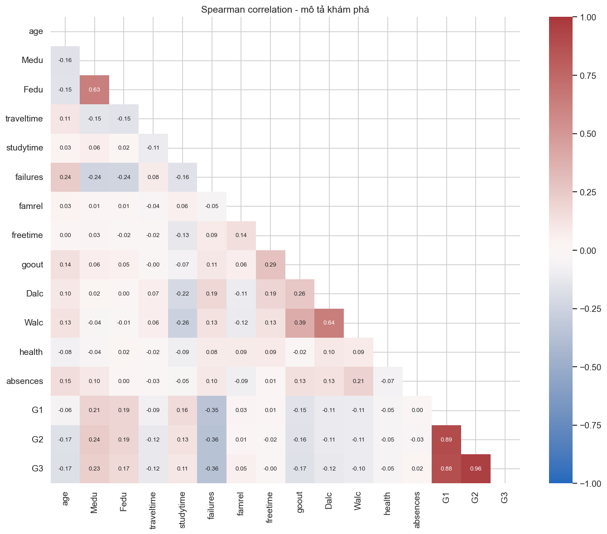
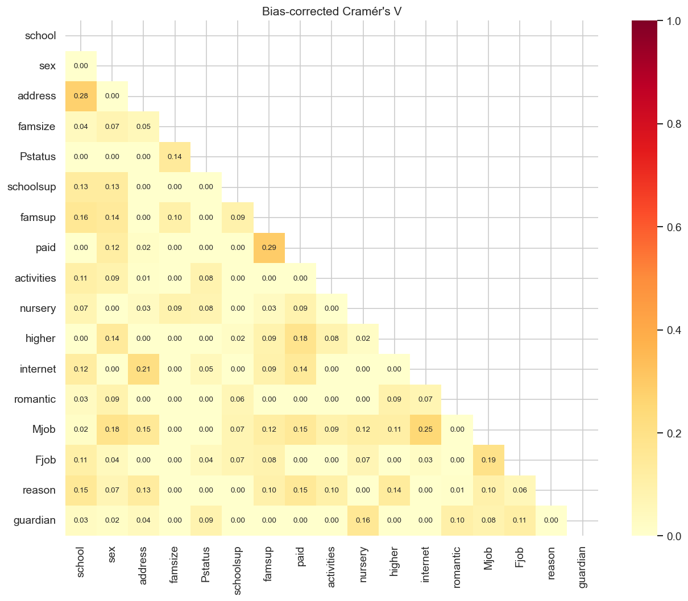
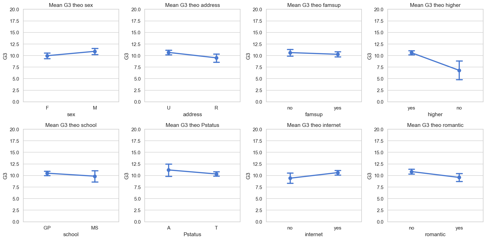
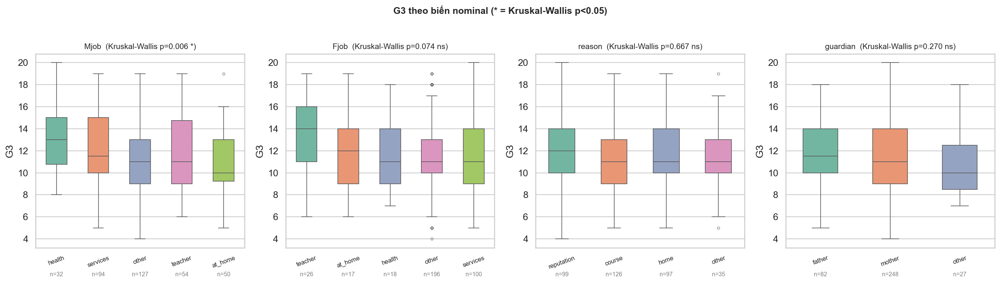
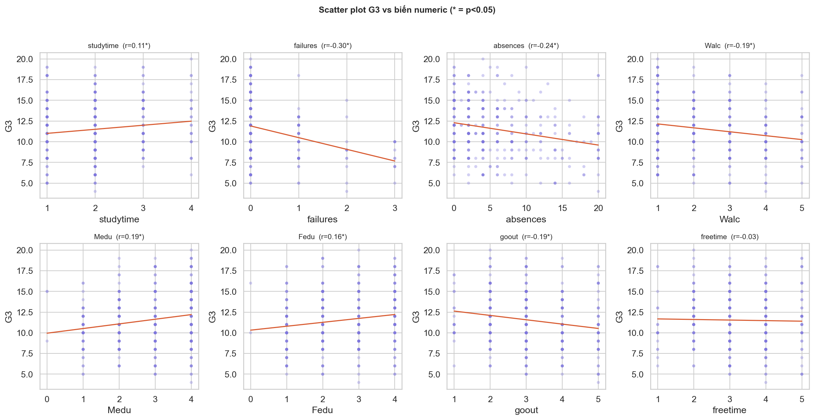

# PHẦN II — DỮ LIỆU VÀ LÝ THUYẾT ĐO LƯỜNG

> **Học phần:** IT2022E — Thống kê ứng dụng và Quy hoạch thực nghiệm.
> **Kế thừa:** [`01_tong_quan_va_pipeline.md`](01_tong_quan_va_pipeline.md) (bối cảnh, mục
> tiêu, pipeline).
>
> File này trả lời **Câu hỏi nghiên cứu Q1** (phân phối `G3` và đặc điểm mẫu) ở mức mô tả, và
> đặt nền **lý thuyết đo lường** cho mọi phân tích suy luận sau. Mọi kết quả ở đây là **mô tả
> / khám phá (exploratory)** — không kết luận nhân quả và không dùng p-value EDA làm bằng
> chứng xác nhận. *Nguồn:* `notebooks/core/01_data_preparation_and_eda.ipynb` và
> `notebooks/appendix/01_EDA.ipynb`.

---

## 1. Nguồn dữ liệu và đơn vị quan sát

- **Nguồn:** Student Performance Dataset — UCI Machine Learning Repository (Cortez & Silva,
  2008), thu thập từ báo cáo và khảo sát học sinh tại hai trường trung học ở Bồ Đào Nha.
- **Tệp:** [`data/raw/student-mat.csv`](../../data/raw/student-mat.csv) (phân tách bằng `;`),
  **read-only**.
- **Đơn vị quan sát:** một học sinh học **môn Toán** tại trường Gabriel Pereira (`GP`) hoặc
  Mousinho da Silveira (`MS`).
- **Biến kết quả:** `G3` — điểm cuối kỳ, thang **0–20**.
- **Quy mô:** **395** học sinh × **33** biến; **0** giá trị thiếu, **0** dòng trùng lặp.

| | GP | MS | Tổng |
|---|---:|---:|---:|
| Nữ (F) | — | — | 208 |
| Nam (M) | — | — | 187 |
| **Tổng** | **349** | **46** | **395** |

> Mẫu chỉ đến từ **hai trường**, không phải mẫu ngẫu nhiên toàn quốc. Đây là giới hạn cốt lõi
> về khả năng khái quát hóa, sẽ được nhắc lại trong phần sai số.

---

## 2. Từ điển biến và mức độ đo lường

### 2.1. Bốn mức độ đo lường

Việc xác định **mức độ đo lường** (level of measurement) của mỗi biến quyết định phép thống kê
được phép dùng — đây là lý do phần này đứng trước mọi suy luận.

| Mức | Đặc trưng | Phép hợp lệ |
|---|---|---|
| **Định danh (nominal)** | Nhóm không thứ tự | Tần số, mode, Cramér's V, chi-square |
| **Thứ bậc (ordinal)** | Có thứ tự, khoảng cách **chưa chắc** đều | Trung vị, hạng, Spearman, Kruskal–Wallis |
| **Đếm (count)** | Số nguyên không âm | Trung bình, mô hình count |
| **Điểm số (score)** | Thang số có khoảng cách, bị chặn 0–20 | Trung bình, SD, tương quan, hồi quy |

### 2.2. Từ điển 33 biến

| Biến | Ý nghĩa | Mức đo | Giá trị |
|---|---|---|---|
| `school` | Trường | Định danh | GP / MS |
| `sex` | Giới tính | Định danh (nhị phân) | F / M |
| `age` | Tuổi | Đếm | 15–22 |
| `address` | Khu vực sống | Định danh (nhị phân) | U (đô thị) / R (nông thôn) |
| `famsize` | Cỡ gia đình | Định danh (nhị phân) | LE3 (≤3) / GT3 (>3) |
| `Pstatus` | Cha mẹ sống chung? | Định danh (nhị phân) | T (chung) / A (riêng) |
| `Medu` | Học vấn mẹ | Thứ bậc | 0–4 |
| `Fedu` | Học vấn cha | Thứ bậc | 0–4 |
| `Mjob`, `Fjob` | Nghề mẹ / cha | Định danh | teacher, health, services, at_home, other |
| `reason` | Lý do chọn trường | Định danh | home, reputation, course, other |
| `guardian` | Người giám hộ | Định danh | mother, father, other |
| `traveltime` | Thời gian đi học | Thứ bậc | 1 (<15′) … 4 (>60′) |
| `studytime` | Tự học/tuần | Thứ bậc | 1 (<2h) … 4 (>10h) |
| `failures` | Số lần trượt môn trước | Đếm → xử lý thứ bậc | 0–3 |
| `schoolsup` | Hỗ trợ học từ trường | Định danh (nhị phân) | yes / no |
| `famsup` | Hỗ trợ học từ gia đình | Định danh (nhị phân) | yes / no |
| `paid` | Học thêm môn Toán có phí | Định danh (nhị phân) | yes / no |
| `activities` | Hoạt động ngoại khóa | Định danh (nhị phân) | yes / no |
| `nursery` | Từng học mẫu giáo | Định danh (nhị phân) | yes / no |
| `higher` | Muốn học đại học | Định danh (nhị phân) | yes / no |
| `internet` | Có internet ở nhà | Định danh (nhị phân) | yes / no |
| `romantic` | Đang có quan hệ tình cảm | Định danh (nhị phân) | yes / no |
| `famrel` | Chất lượng quan hệ gia đình | Thứ bậc | 1–5 |
| `freetime` | Thời gian rảnh sau giờ học | Thứ bậc | 1–5 |
| `goout` | Đi chơi với bạn | Thứ bậc | 1–5 |
| `Dalc` | Uống rượu ngày thường | Thứ bậc | 1–5 |
| `Walc` | Uống rượu cuối tuần | Thứ bậc | 1–5 |
| `health` | Tình trạng sức khỏe | Thứ bậc | 1–5 |
| `absences` | Số ngày vắng | Đếm | 0–75 |
| `G1` | Điểm kỳ 1 | Điểm số | 0–20 |
| `G2` | Điểm kỳ 2 | Điểm số | 0–20 |
| **`G3`** | **Điểm cuối kỳ (response)** | **Điểm số** | **0–20** |

**Hai cảnh báo về thang đo (rất quan trọng cho phần sau):**

- `studytime=4` **không** bằng hai lần `studytime=2` — đây là các **khoảng** thời gian được
  mã hóa. Mọi mô hình coi biến thứ bậc như số liên tục đều phải diễn giải thận trọng (sẽ kiểm
  tra bằng sensitivity "ordinal-as-category" ở phần hồi quy).
- `failures` về bản chất là **biến đếm**, nhưng vì chỉ có 4 mức và phân bố rất lệch nên trong
  kiểm định được xử lý như **biến thứ bậc** (Kruskal–Wallis).

### 2.3. Thống kê mô tả các biến số

| Biến | Mean | SD | Min | Median | Max | Skewness |
|---|---:|---:|---:|---:|---:|---:|
| `age` | 16,70 | 1,28 | 15 | 17 | 22 | 0,47 |
| `Medu` | 2,75 | 1,09 | 0 | 3 | 4 | −0,32 |
| `Fedu` | 2,52 | 1,09 | 0 | 2 | 4 | −0,03 |
| `studytime` | 2,04 | 0,84 | 1 | 2 | 4 | 0,63 |
| `failures` | 0,33 | 0,74 | 0 | 0 | 3 | **2,39** |
| `Walc` | 2,29 | 1,29 | 1 | 2 | 5 | 0,61 |
| `Dalc` | 1,48 | 0,89 | 1 | 1 | 5 | **2,19** |
| `absences` | 5,71 | 8,00 | 0 | 4 | 75 | **3,67** |
| `G1` | 10,91 | 3,32 | 3 | 11 | 19 | 0,24 |
| `G2` | 10,71 | 3,76 | 0 | 11 | 19 | −0,43 |
| **`G3`** | **10,42** | **4,58** | **0** | **11** | **20** | **−0,73** |

Các biến `failures`, `Dalc`, `absences` có **độ lệch (skewness) lớn** → ủng hộ việc dùng
phương pháp dựa trên hạng (Spearman, Kruskal–Wallis) thay vì giả định chuẩn.

---

## 3. Phân phối biến kết quả `G3`

`G3` có **trung bình 10,42**, **trung vị 11**, **SD 4,58**, trải từ 0 đến 20. Đặc điểm nổi
bật là **một điểm khối (point mass) tại 0**: có **38 học sinh `G3=0` (9,62%)**, tương ứng học
sinh không có điểm cuối kỳ. Điều này làm phân phối lệch trái (skew −0,73) và **không gần
chuẩn**, thể hiện rõ ở đuôi của Q-Q plot.

**Hình 1.** Phân phối `G3` (trái) và so sánh theo trường GP/MS (phải).

**Hình 2.** Histogram, boxplot và Q-Q plot của `G3`. Điểm khối tại 0 tách khỏi phần còn lại
của phân phối và làm lệch đuôi Q-Q.

### Sensitivity: giữ hay loại `G3=0`?

`G3=0` là giá trị **hợp lệ** theo data dictionary (thang 0–20), nên **phân tích chính giữ đủ
395 quan sát** (quyết định D-003). Việc loại điểm 0 chỉ là **phân tích độ nhạy**:

| Mẫu | n | Mean | Median | SD |
|---|---:|---:|---:|---:|
| Toàn bộ (chính) | 395 | 10,42 | 11 | 4,58 |
| Chỉ `G3>0` (sensitivity) | 357 | 11,52 | 11 | 3,23 |

Loại `G3=0` kéo trung bình lên ~1,1 điểm và giảm mạnh SD — cho thấy nhóm điểm 0 ảnh hưởng đáng
kể đến ước lượng, nên việc **giữ** nó là một lựa chọn có hệ quả và phải minh bạch.

---

## 4. Outlier và biến `absences`

Theo quy tắc IQR (`[Q1 − 1,5·IQR, Q3 + 1,5·IQR]`):

| Biến | Ngưỡng dưới | Ngưỡng trên | Số outlier |
|---|---:|---:|---:|
| `age` | 13 | 21 | 1 |
| `absences` | −12 | 20 | 15 |
| `G1` | 0,5 | 20,5 | 0 |
| `G2` | 3 | 19 | 13 |
| `G3` | −1 | 23 | 0 |

**Hình 3.** Boxplot các biến liên tục. `absences` có đuôi phải dài (max 75), tạo nhiều điểm
nằm ngoài ngưỡng IQR.

**Quyết định D-004:** **không** loại bỏ hay winsorize `absences` trong dataset chính, vì giá
trị lớn có thể là quan sát thật và việc cắt tùy ý làm thay đổi estimand. Winsorization chỉ
dùng để **kiểm tra độ nhạy**, và kết quả gần như không đổi:

- Spearman `absences`–`G3` (gốc): rho = **0,018**, p = 0,725.
- Spearman `absences`–`G3` (winsorize @95%): rho = **0,018**, p = 0,714.

> Vì giả thuyết về `absences` (H9) hình thành **sau** khi xem EDA, nó được gắn nhãn
> **post-hoc/exploratory** (D-007) và sẽ luôn được trình bày như vậy.

---

## 5. Mối liên hệ mô tả với `G3` (khám phá)

Phần này **khám phá** liên hệ giữa các biến và `G3` để **gợi ý giả thuyết**, không phải kết
luận xác nhận. Mọi p-value ở đây chưa hiệu chỉnh đa kiểm định.

### 5.1. Tương quan hạng (Spearman) với `G3`

Tương quan Spearman của các biến (trừ `G1`, `G2`) với `G3`, sắp theo độ lớn:

| Biến | rho | Biến | rho |
|---|---:|---|---:|
| `failures` | **−0,361** | `traveltime` | −0,121 |
| `Medu` | 0,225 | `studytime` | 0,105 |
| `age` | −0,173 | `Walc` | −0,104 |
| `Fedu` | 0,170 | `famrel` | 0,055 |
| `goout` | −0,166 | `health` | −0,048 |
| `Dalc` | −0,121 | `absences` | 0,018 |

`failures` có liên hệ âm rõ nhất; trình độ học vấn cha mẹ (`Medu`, `Fedu`) liên hệ dương; phần
lớn biến hành vi có liên hệ yếu. Đây là cơ sở để chọn các giả thuyết H1–H9.

**Hình 4.** Ma trận tương quan Spearman giữa các biến số (khám phá). `G1`, `G2` tương quan rất
cao với `G3` (sẽ phân tích ở phần hồi quy).

### 5.2. Liên hệ giữa các biến phân loại (Cramér's V)

Với các biến định danh, dùng **Cramér's V bias-corrected** để đo độ mạnh liên hệ cặp đôi
(giá trị 0–1), tránh thổi phồng khi bảng chéo lớn.

**Hình 5.** Cramér's V (đã hiệu chỉnh chệch) giữa các biến phân loại. Hữu ích để phát hiện
các biến nền có thể trùng thông tin (collinearity tiềm năng cho hồi quy).

### 5.3. Khác biệt `G3` theo nhóm

**Hình 6.** Trung bình `G3` (kèm CI 95%) theo các biến nhị phân/nhóm. Khác biệt theo `higher`
nổi bật, nhưng nhóm `higher=no` rất nhỏ (n=20) nên CI rộng.

**Hình 7.** Phân phối `G3` theo các biến định danh (`Mjob`, `Fjob`, `reason`, `guardian`) —
khám phá, sắp theo trung vị.

### 5.4. Quan hệ với biến thứ bậc / đếm

**Hình 8.** Quan hệ giữa `G3` và `studytime`, `failures`, `absences`, `Walc`, `Medu`, `Fedu`,
`goout`, `freetime` (đường lowess). Hầu hết quan hệ yếu hoặc phi tuyến nhẹ.

> **Lưu ý diễn giải:** toàn bộ §5 là mô tả khám phá. Kết luận xác nhận chỉ đến từ phần kiểm
> định giả thuyết (có Holm correction) và hồi quy ở các file sau.

---

## 6. Độ tin cậy (reliability) và độ giá trị (validity) của phép đo

### 6.1. Biến kết quả `G3`

`G3` có **độ giá trị nội dung trực tiếp** đối với kết quả môn học. Tuy nhiên, một bài thi đơn
lẻ **không** phản ánh đầy đủ năng lực học tập: điểm còn chịu ảnh hưởng của độ khó đề, điều
kiện thi, cách chấm và trạng thái học sinh tại thời điểm thi. Vì vậy `G3` là một **đại diện
(proxy)** có sai số đo lường cho "năng lực", không phải phép đo hoàn hảo.

### 6.2. Các biến tự báo cáo

`studytime`, `Walc`, `Dalc`, `famrel`, `health` chủ yếu dựa trên **tự báo cáo**, nên có thể
chịu:

- **Recall bias** — ước lượng sai thời gian tự học, số lần đi chơi…
- **Social desirability bias** — khai mức uống rượu thấp hơn thực tế.

Sai số ngẫu nhiên thường **làm yếu** mối liên hệ quan sát được; sai số có hệ thống có thể
**tạo hoặc che giấu** liên hệ. Đây là lý do effect size nhỏ cần được diễn giải thận trọng.

### 6.3. Giới hạn đo lường cấu trúc tiềm ẩn

Nhiều khái niệm phức tạp chỉ được đo bằng **một biến (single item)**:

- `famsup` chỉ cho biết **có/không** hỗ trợ gia đình, không phản ánh tần suất, chất lượng hay
  hình thức.
- `famrel` dùng **một** thang 1–5 duy nhất.

Vì mỗi cấu trúc tiềm ẩn chỉ có một item, **không thể** tính các chỉ số độ tin cậy nội tại như
**Cronbach's alpha**, và project **không** thực hiện phân tích thang đo đa mục. Đây là một
giới hạn về thiết kế đo lường của dataset, không phải lỗi phân tích.

---

## 7. Quyết định chuẩn bị dữ liệu

| Mã | Quyết định | Hệ quả |
|---|---|---|
| D-002 | `data/raw/` read-only; output vào `data/processed/` | Bảo đảm truy vết & tái lập |
| D-003 | **Giữ `G3=0`** trong phân tích chính | `G3>0` chỉ là sensitivity, không thay kết quả chính |
| D-004 | **Không** winsorize/loại `absences` | Winsorization chỉ để kiểm tra độ nhạy |
| D-007 | H9 (`absences`) là **post-hoc/exploratory** | Luôn gắn nhãn khi trình bày |

**Sản phẩm của phase này:** notebook 01 xuất
[`data/processed/student_mat_clean.csv`](../../data/processed/student_mat_clean.csv) —
**395 × 33**, giữ nguyên `G3=0` và `absences`. Hậu tố `_clean` chỉ là **chuẩn hóa định dạng**
(`;` → `,`), KHÔNG biến đổi dữ liệu. File này là đầu vào chung cho mọi phân tích suy luận tiếp
theo.

---

## 8. Kết luận phần II

- Bộ dữ liệu **395 học sinh × 33 biến**, hai trường, **không** missing/duplicate.
- `G3` thang 0–20, mean 10,42, có **point mass tại 0 (9,62%)** → phân phối không chuẩn, định
  hướng dùng phương pháp dựa trên hạng và báo cáo effect size + CI.
- Phân loại đo lường (định danh / thứ bậc / đếm / điểm số) **ràng buộc** lựa chọn phương pháp;
  biến thứ bậc và `failures` cần xử lý thận trọng.
- Nhiều biến tự báo cáo và single-item → có sai số đo lường, không đánh giá được độ tin cậy
  nội tại.
- Mọi liên hệ mô tả ở đây là **khám phá**; kết luận xác nhận thuộc về
  [`03_suy_luan_thong_ke.md`](03_suy_luan_thong_ke.md) (kiểm định + Holm) và phần hồi quy.

> **Hình sử dụng trong file này:** 8 hình `eda_*` —
> [`eda_course_overview`](../figures/eda_course_overview.png),
> [`eda_g3_distribution`](../figures/eda_g3_distribution.png),
> [`eda_outliers_boxplot`](../figures/eda_outliers_boxplot.png),
> [`eda_correlation_heatmap_spearman`](../figures/eda_correlation_heatmap_spearman.png),
> [`eda_cramers_v_heatmap`](../figures/eda_cramers_v_heatmap.png),
> [`eda_g3_by_group`](../figures/eda_g3_by_group.png),
> [`eda_g3_by_nominal`](../figures/eda_g3_by_nominal.png),
> [`eda_scatter_g3`](../figures/eda_scatter_g3.png).
