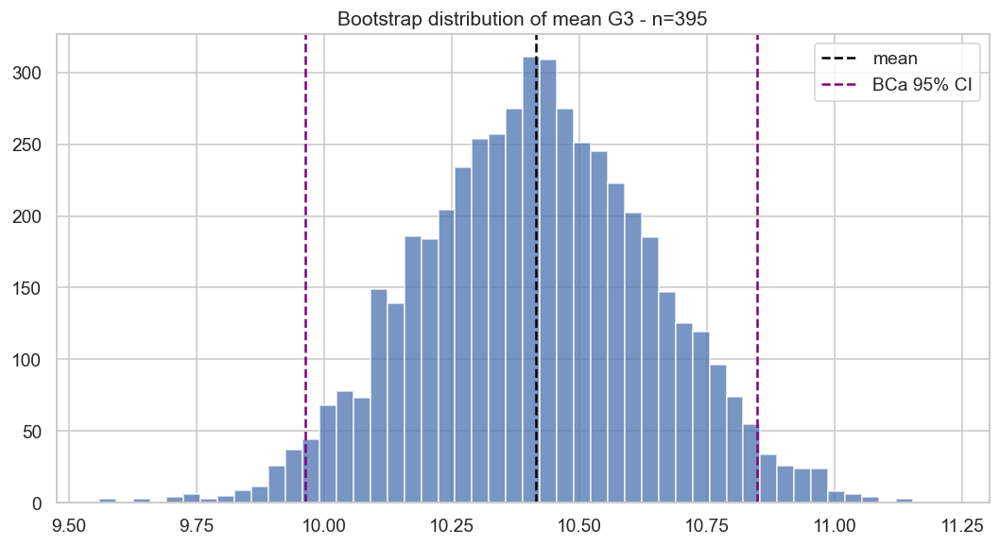
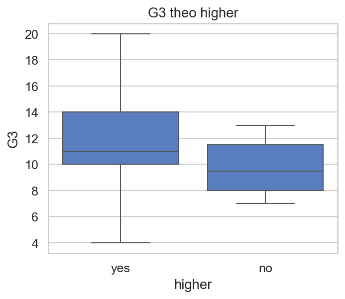
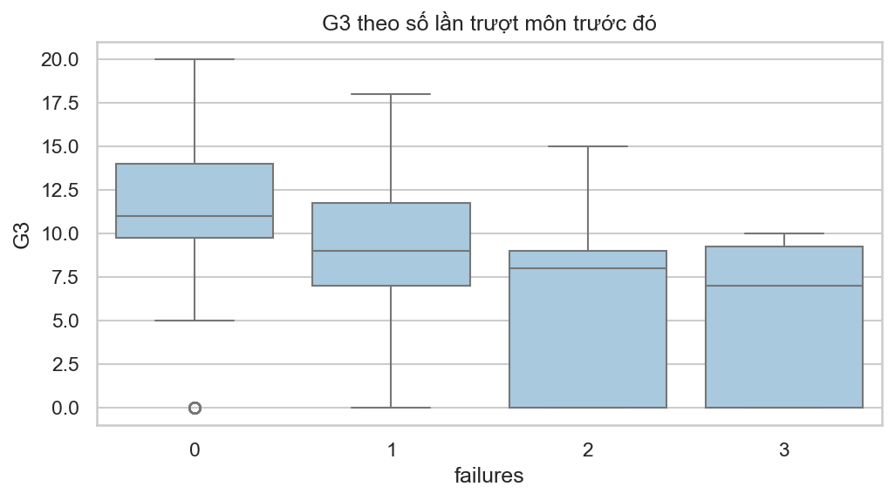
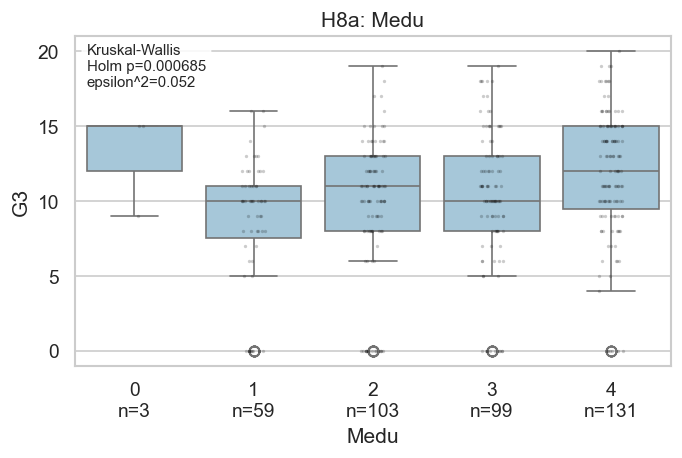
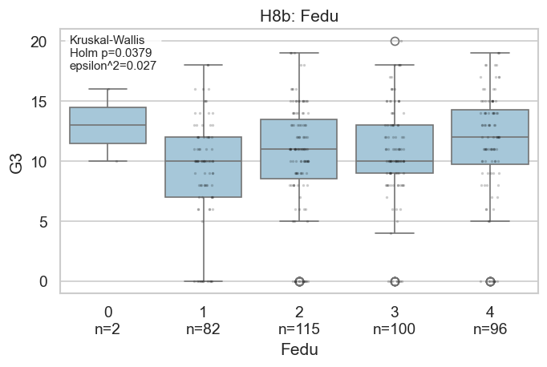
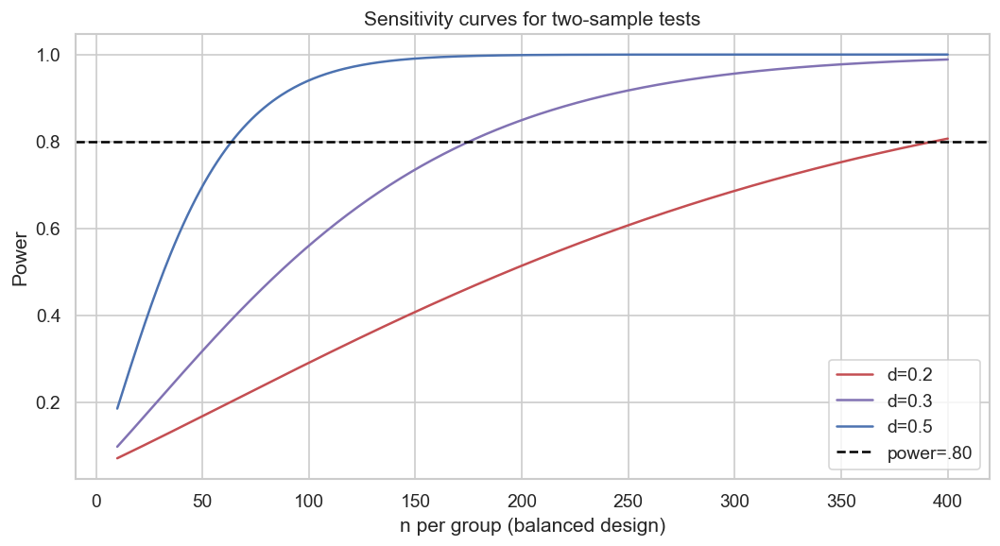

# PHẦN III — SUY LUẬN THỐNG KÊ

> **Học phần:** IT2022E — Thống kê ứng dụng và Quy hoạch thực nghiệm.
> **Kế thừa:** [`01_tong_quan_va_pipeline.md`](01_tong_quan_va_pipeline.md) và
> [`02_du_lieu_va_ly_thuyet_do_luong.md`](02_du_lieu_va_ly_thuyet_do_luong.md).
>
> File này trả lời **Câu hỏi nghiên cứu Q2**: ước lượng khoảng tin cậy cho `G3` và kiểm định
> 10 giả thuyết về mối liên hệ giữa `G3` với các biến nền/hành vi. *Nguồn:*
> `notebooks/core/02_statistical_inference.ipynb`,
> `notebooks/appendix/02_hypothesis_testing.ipynb`,
> `notebooks/appendix/03_confidence_intervals.ipynb`.

---

## 1. Khung suy luận chung

Mọi kiểm định/ước lượng trong file này tuân thủ quy ước thống nhất:

- **Mức ý nghĩa** `α = 0,05`; mọi kiểm định **hai phía**.
- Luôn báo cáo **effect size** và **khoảng tin cậy (CI)** bên cạnh p-value — phân biệt ý nghĩa
  thống kê với ý nghĩa thực tiễn.
- **Đa kiểm định** (10 giả thuyết chính) → kết luận xác nhận dựa trên **Holm-adjusted
  p-value** (`p_holm`), không dựa trên p-value thô.
- Các kiểm tra phân phối/phương sai (**Shapiro–Wilk, Levene**) chỉ là **diagnostic**, KHÔNG
  dùng làm pre-test để tự động đổi phương pháp.
- Giả định **độc lập** giữa các quan sát là một **giới hạn** (học sinh nằm trong 2 trường).
- Kết quả là **association** trong dữ liệu quan sát, **không** phải nhân quả.

---

## 2. Ước lượng khoảng tin cậy cho trung bình `G3`

### 2.1. Setup
Ước lượng trung bình tổng thể μ của `G3` trên toàn mẫu **n = 395**, so sánh **ba phương pháp**
để kiểm tra độ bền vững khi phân phối lệch và có point-mass tại 0: (i) t cổ điển; (ii)
bootstrap percentile; (iii) bootstrap **BCa**.

### 2.2. Phân tích toán học

- **t-CI:** `x̄ ± t(0,975; n−1) · s/√n`, với `s` là độ lệch chuẩn mẫu, `s/√n` là sai số chuẩn.
- **Bootstrap percentile:** lấy lại mẫu có hoàn lại **B = 5.000** lần, tính trung bình mỗi
  lần; CI là khoảng giữa phân vị **2,5%** và **97,5%** của phân phối bootstrap.
- **BCa (bias-corrected and accelerated):** điều chỉnh hai đầu phân vị theo:
  - hệ số chệch `z₀ = Φ⁻¹( tỉ lệ mẫu bootstrap < ước lượng gốc )`;
  - hệ số gia tốc `a` ước lượng từ **jackknife** (đo độ bất đối xứng).
  - *Lý do dùng BCa:* hiệu chỉnh được cả chệch và bất đối xứng của phân phối bootstrap — phù
    hợp khi `G3` lệch trái và có khối tại 0.

### 2.3. Phân tích kết quả

| Đại lượng | Phương pháp | Ước lượng | CI 95% |
|---|---|---:|---|
| Trung bình `G3` | t | 10,415 | [9,962; 10,868] |
| Trung bình `G3` | bootstrap percentile | 10,415 | [9,975; 10,858] |
| Trung bình `G3` | bootstrap BCa | 10,415 | [9,965; 10,848] |
| Trung vị `G3` | bootstrap percentile | 11,0 | [10,0; 11,0] |

Ba khoảng cho trung bình **gần như trùng nhau** ⇒ ước lượng trung bình toàn mẫu **ổn định**,
dù phân phối không chuẩn. Đây là minh chứng cho định lý giới hạn trung tâm với n=395.



**Hình 1.** Phân phối bootstrap (5.000 mẫu) của trung bình `G3`; đường dọc là trung bình mẫu
và hai đầu CI BCa.

---

## 3. Khoảng tin cậy cho bốn contrast định nghĩa trước

### 3.1. Setup
Ước lượng chênh lệch trung bình `G3` giữa hai nhóm cho **bốn contrast đã định trước** (không
chọn sau khi xem dữ liệu): `sex (M−F)`, `address (U−R)`, `higher (yes−no)`, `failures (0−>0)`.

### 3.2. Phân tích toán học
**Welch CI cho chênh lệch hai trung bình** (không giả định đồng phương sai):

```
(x̄₁ − x̄₂) ± t(0,975; df) · √(s₁²/n₁ + s₂²/n₂)
df (Welch–Satterthwaite) = (s₁²/n₁ + s₂²/n₂)² / [ (s₁²/n₁)²/(n₁−1) + (s₂²/n₂)²/(n₂−1) ]
```

Bổ sung **bootstrap CI** (lấy lại độc lập từng nhóm) và **Hedges g** (effect size có hiệu
chỉnh chệch mẫu nhỏ) cho mỗi contrast.

### 3.3. Phân tích kết quả

| Contrast | n₁ / n₂ | Chênh lệch | Welch 95% CI | Hedges g [CI] |
|---|---:|---:|---|---|
| `sex` (M − F) | 187 / 208 | 0,948 | [0,045; 1,851] | 0,207 [0,009; 0,410] |
| `address` (U − R) | 307 / 88 | 1,163 | [0,073; 2,252] | 0,254 [0,024; 0,493] |
| `higher` (yes − no) | 375 / 20 | **3,808** | [1,509; 6,107] | **0,843** [0,401; 1,329] |
| `failures` (0 − >0) | 312 / 83 | **3,988** | [2,862; 5,114] | **0,928** [0,670; 1,209] |


**Hình 2.** Chênh lệch trung bình `G3` (bootstrap 95% CI) cho bốn contrast. `higher` và
`failures` có effect size lớn nhất.

> ⚠️ **Cảnh báo diễn giải then chốt:** đây là các CI **riêng lẻ**, KHÔNG phải simultaneous CI.
> CI của `sex` và `address` không chứa 0, nhưng **sau Holm correction** (mục 4) hai giả thuyết
> này **không** còn ý nghĩa. CI lượng hóa độ bất định của ước lượng; kết luận xác nhận cho cả
> họ giả thuyết vẫn dựa trên Holm.

---

## 4. Kiểm định 10 giả thuyết chính (H1–H9)

### 4.1. Thiết kế kiểm định: H0/H1, giả định, quy tắc

| Mã | Biến | Kiểm định | H0 | H1 |
|---|---|---|---|---|
| H1 | `sex` | Welch t | μ_M = μ_F | μ_M ≠ μ_F |
| H2 | `address` | Welch t | μ_U = μ_R | μ_U ≠ μ_R |
| H3 | `famsup` | Welch t | μ_yes = μ_no | ≠ |
| H4 | `studytime` | Kruskal–Wallis | phân phối `G3` đồng nhất giữa các mức | ít nhất một khác |
| H5 | `Walc` | Spearman | ρ_s = 0 | ρ_s ≠ 0 |
| H6 | `higher` | Welch t | μ_yes = μ_no | ≠ |
| H7 | `failures` | Kruskal–Wallis (+Dunn) | phân phối `G3` đồng nhất | ít nhất một khác |
| H8a | `Medu` | Kruskal–Wallis (+Dunn) | phân phối `G3` đồng nhất | ít nhất một khác |
| H8b | `Fedu` | Kruskal–Wallis (+Dunn) | phân phối `G3` đồng nhất | ít nhất một khác |
| H9 | `absences` | Spearman | ρ_s = 0 | ρ_s ≠ 0 — **post-hoc/exploratory** |

- **Giả định & xử lý:** Levene (đồng phương sai) và Shapiro (chuẩn) chỉ báo cáo như diagnostic
  (ví dụ Levene của H1=0,794; H2=0,843; H3=0,989; H6=0,593 — không có bằng chứng lệch phương
  sai mạnh). Welch t **không** giả định đồng phương sai nên bền vững dù sao.
- **Quy tắc quyết định:** bác bỏ H0 khi **`p_holm < 0,05`**.

### 4.2. Phân tích toán học (công thức đầy đủ + lý do chọn)

**Công thức:**
- **Welch t:** `t = (x̄₁ − x̄₂) / √(s₁²/n₁ + s₂²/n₂)`, df Welch–Satterthwaite (mục 3.2).
- **Kruskal–Wallis:** `H = 12/[N(N+1)] · Σ Rᵢ²/nᵢ − 3(N+1)` (Rᵢ = tổng hạng nhóm i, k nhóm);
  effect size `ε² = (H − k + 1)/(N − k)`.
- **Spearman:** `ρ_s` = hệ số Pearson trên hạng; kiểm định qua xấp xỉ phân phối t.
- **Hedges g:** `g = d · (1 − 3/[4(n₁+n₂) − 9])`, `d` = chênh lệch trung bình / SD gộp.
- **Holm (step-down):** sắp p tăng dần `p(1) ≤ … ≤ p(m)`; với bước i, so `p(i)` với ngưỡng
  `α/(m − i + 1)`; dừng tại vi phạm đầu tiên. Kiểm soát **FWER** cho m = 10.

**Lý do chọn kiểm định:**
- **Welch t** cho biến 2 nhóm: không giả định đồng phương sai và chịu được n không cân bằng
  (chọn thay **Student t**); chọn t thay **Mann–Whitney** vì cần ước lượng **chênh lệch trung
  bình** và cỡ mẫu đủ lớn để dựa vào CLT.
- **Kruskal–Wallis** cho biến thứ bậc nhiều mức: `G3` lệch, bị chặn [0,20], có point-mass →
  không thỏa giả định **ANOVA** chuẩn; KW là kiểm định omnibus theo hạng.
- **Spearman** cho liên hệ đơn điệu theo hạng: biến ordinal, bền với phi tuyến/outlier (thay
  **Pearson**).
- **Holm** thay **Bonferroni**: mạnh hơn (uniformly more powerful) mà vẫn kiểm soát FWER.
- **Hedges g** thay **Cohen d**: hiệu chỉnh chệch mẫu nhỏ — quan trọng vì `higher=no` chỉ n=20.

**Cây quyết định chọn kiểm định** (áp dụng cho mọi giả thuyết):

```
Biến dự báo là gì?
├─ Nhị phân / 2 nhóm độc lập ────────────────► Welch t-test
├─ Thứ bậc ÍT mức, hỏi "G3 KHÁC giữa nhóm?" ─► Kruskal–Wallis (+ Dunn post-hoc)
└─ Thứ bậc/đếm NHIỀU giá trị, hỏi "XU HƯỚNG
   đơn điệu?" ──────────────────────────────► Spearman (rho)
```

**Lý do riêng cho từng giả thuyết H1–H9:**

| Mã | Biến (mức đo) | Cấu trúc so sánh | Kiểm định | Lý do cụ thể |
|---|---|---|---|---|
| H1 | `sex` (định danh nhị phân) | 2 nhóm độc lập (M, F) | **Welch t** | So sánh trung bình `G3` giữa **đúng 2 nhóm**; Welch không giả định đồng phương sai → an toàn khi cỡ/phương sai hai nhóm khác nhau |
| H2 | `address` (định danh nhị phân) | 2 nhóm (U, R) | **Welch t** | 2 nhóm độc lập, như H1 |
| H3 | `famsup` (định danh nhị phân) | 2 nhóm (yes, no) | **Welch t** | 2 nhóm độc lập, như H1 |
| H4 | `studytime` (thứ bậc, 4 mức) | >2 nhóm có thứ tự | **Kruskal–Wallis** (+Dunn) | Hơn 2 nhóm → không dùng t; `G3` lệch/bị chặn → không thỏa ANOVA chuẩn; câu hỏi là "G3 có khác giữa các mức không" → omnibus theo hạng, rồi Dunn tìm cặp khác |
| H5 | `Walc` (thứ bậc, 5 mức) | xu hướng đơn điệu | **Spearman** | Câu hỏi là **xu hướng/liều–đáp ứng**: uống nhiều hơn ↔ điểm thấp hơn; rho cho cả **hướng** và **độ mạnh** của liên hệ đơn điệu trong một con số |
| H6 | `higher` (định danh nhị phân) | 2 nhóm (yes, no) | **Welch t** | 2 nhóm độc lập; nhóm `no` rất nhỏ (n=20) → Welch + Hedges g (hiệu chỉnh mẫu nhỏ) đặc biệt phù hợp |
| H7 | `failures` (đếm → thứ bậc, 4 mức) | >2 nhóm có thứ tự | **Kruskal–Wallis** (+Dunn) | 4 mức, phân bố rất lệch (skew 2,39) → không chuẩn; so sánh giữa các mức rồi Dunn xác định cặp khác |
| H8a | `Medu` (thứ bậc, 5 mức) | >2 nhóm có thứ tự | **Kruskal–Wallis** (+Dunn) | 5 mức học vấn (0–4) → omnibus theo hạng + Dunn |
| H8b | `Fedu` (thứ bậc, 5 mức) | >2 nhóm có thứ tự | **Kruskal–Wallis** (+Dunn) | Như H8a |
| H9 | `absences` (đếm, nhiều giá trị) | xu hướng đơn điệu | **Spearman** | Biến đếm nhiều giá trị riêng biệt, đuôi dài → không gom thành category để dùng KW; đo xu hướng đơn điệu bằng rho; gắn nhãn **post-hoc/exploratory** |

> **Tại sao biến thứ bậc khi thì Kruskal–Wallis, khi thì Spearman?** Cả hai đều hợp lệ cho dữ
> liệu thứ bậc; lựa chọn phản ánh **câu hỏi nghiên cứu**, không phải mức đo:
> - **Kruskal–Wallis** khi quan tâm "có khác biệt giữa các **nhóm** không" và muốn **so sánh
>   cặp** (Dunn) — dùng cho `studytime`, `failures`, `Medu`, `Fedu`.
> - **Spearman** khi quan tâm một **xu hướng đơn điệu có hướng** (một effect size rho duy
>   nhất) — dùng cho `Walc` (liều–đáp ứng) và `absences` (biến đếm nhiều giá trị).

### 4.3. Kết quả tổng hợp (sau Holm correction)

| Giả thuyết | Thống kê | `p_raw` | `p_holm` | Effect size | KL (Holm) | Hình |
|---|---:|---:|---:|---:|:---:|:---:|
| H1 `sex` | t=2,065 | 0,0396 | 0,220 | g=0,207 | — | [hyp](../figures/hyp_h1_sex_g3.png) |
| H2 `address` | t=2,110 | 0,0366 | 0,220 | g=0,254 | — | [hyp](../figures/hyp_h2_address_g3.png) |
| H3 `famsup` | t=−0,774 | 0,440 | 0,880 | g=−0,080 | — | [hyp](../figures/hyp_h3_famsup_g3.png) |
| H4 `studytime` | H=7,579 | 0,0556 | 0,220 | ε²=0,012 | — | [hyp](../figures/hyp_h4_studytime_g3.png) |
| H5 `Walc` | ρ=−0,104 | 0,0380 | 0,220 | ρ=−0,104 | — | [hyp](../figures/hyp_h5_walc_g3.png) |
| **H6 `higher`** | t=3,447 | 0,00244 | **0,0195** | **g=0,843** | ✅ | [hyp](../figures/hyp_h6_higher_g3.png) |
| **H7 `failures`** | H=53,115 | 1,7e-11 | **1,7e-10** | **ε²=0,128** | ✅ | [hyp](../figures/hyp_h7_failures_g3.png) |
| **H8a `Medu`** | H=24,104 | 7,6e-5 | **6,9e-4** | ε²=0,052 | ✅ | [hyp](../figures/hyp_h8a_medu_g3.png) |
| **H8b `Fedu`** | H=14,677 | 5,4e-3 | **0,0379** | ε²=0,027 | ✅ | [hyp](../figures/hyp_h8b_fedu_g3.png) |
| H9 `absences` | ρ=0,018 | 0,725 | 0,880 | ρ=0,018 | — | [hyp](../figures/hyp_h9_absences_g3.png) |

**Bốn giả thuyết có ý nghĩa sau Holm:** H6 `higher`, H7 `failures`, H8a `Medu`, H8b `Fedu`.
**Rớt sau Holm:** `sex`, `address`, `famsup`, `studytime`, `Walc`, `absences`.

### 4.4. Phân tích từng kết quả có ý nghĩa

**H6 — Định hướng học đại học (`higher`).** Nhóm `yes` có `G3` cao hơn `no` **3,808 điểm**
(Welch 95% CI [1,509; 6,107]; Hedges g = 0,843 — effect lớn). Nhưng **`no` chỉ có 20 học
sinh**, nên CI rất rộng. Khác biệt có thể phản ánh động lực/năng lực nền, **không** phải tác
động của việc trả lời "có".



**Hình 3.** `G3` theo `higher` (nhóm `no` rất nhỏ).

**H7 — Số lần trượt môn (`failures`).** Kruskal–Wallis `H = 53,115`, p rất nhỏ, **ε² = 0,128**
(lớn nhất trong các biến). Đây cũng là contrast `0 − (>0) = 3,988` điểm ở mục 3. Dunn post-hoc
(mục 5) cho thấy nhóm `failures=0` khác **từng** mức 1, 2, 3; **không** nên suy rộng rằng mọi
cặp mức đều khác nhau.



**Hình 4.** Phân phối `G3` theo `failures`.

**H8a/H8b — Trình độ học vấn cha mẹ (`Medu`, `Fedu`).** Có khác biệt omnibus sau Holm nhưng
effect **nhỏ** (ε² ≈ 0,052 và 0,027). Ý nghĩa thống kê **không** đồng nghĩa chênh lệch lớn
thực tiễn; `Medu`/`Fedu` còn có thể đại diện cho điều kiện kinh tế, tài nguyên học tập, kỳ vọng
giáo dục.



**Hình 5.** `G3` theo trình độ học vấn mẹ (`Medu`).



**Hình 6.** `G3` theo trình độ học vấn cha (`Fedu`).

**Các giả thuyết không có ý nghĩa.** `sex`, `address` có CI riêng lẻ không chứa 0 nhưng rớt
sau Holm. `Walc` có rho thô −0,104 (p=0,038) nhưng cũng rớt. **H9 `absences`** có rho ≈ 0
(0,018) và là giả thuyết **exploratory** — không hỗ trợ kết luận về quan hệ đơn điệu với `G3`.

---

## 5. Dunn post-hoc sau Kruskal–Wallis

Sau khi omnibus có ý nghĩa, dùng **Dunn test** (z chuẩn hóa chênh lệch hạng trung bình, **có
hiệu chỉnh ties**) + Holm cho các cặp. Các cặp **còn ý nghĩa sau Holm**:

| Biến | Cặp khác biệt (Holm) | `p_holm` |
|---|---|---:|
| `failures` | 0 vs 1 | 4,9e-5 |
| `failures` | 0 vs 2 | 8,0e-5 |
| `failures` | 0 vs 3 | 1,0e-5 |
| `Medu` | 1 vs 4 | 8,2e-5 |
| `Medu` | 2 vs 4 | 0,011 |
| `Fedu` | 1 vs 4 | 1,8e-3 |
| `studytime` | (không cặp nào) | — |

Khác biệt tập trung ở **`failures=0` so với mọi mức >0**, và ở **mức học vấn cha mẹ cao nhất
(4) so với mức thấp**. `studytime` không có cặp nào qua Holm — nhất quán với omnibus không ý
nghĩa.

---

## 6. Phân tích độ nhạy power: Minimum Detectable Effect (MDE)

### 6.1. Lý do dùng MDE thay observed power
Observed power tính từ effect size quan sát là **diễn giải vòng tròn** (hàm của p-value). Thay
vào đó, báo cáo **MDE** — effect chuẩn hóa nhỏ nhất mà thiết kế phát hiện được ở **power 80%**
với cỡ nhóm hiện có. MDE trả lời "thiết kế này đủ nhạy đến đâu", độc lập với kết quả đã thấy.

### 6.2. Kết quả

| Contrast | n₁ / n₂ | MDE (Cohen/Hedges d) @ power 80% |
|---|---:|---:|
| `sex` | 187 / 208 | 0,283 |
| `address` | 307 / 88 | 0,340 |
| `higher` | 375 / 20 | **0,645** |
| `failures` (0 vs >0) | 312 / 83 | 0,347 |

`higher` có MDE lớn nhất (0,645) do nhóm `no` rất nhỏ → thiết kế **kém nhạy** với contrast này,
dễ bỏ sót effect vừa/nhỏ. (ANOVA xấp xỉ cho `failures` 4 nhóm: MDE Cohen f ≈ 0,167 — chỉ tham
khảo vì nhóm mất cân bằng và phân tích chính dùng Kruskal–Wallis.)



**Hình 7.** Power theo cỡ nhóm cho kiểm định hai mẫu ở các mức effect d = 0,2 / 0,3 / 0,5.

---

## 7. Kết luận phần III

- Trung bình `G3` ≈ **10,415**, CI 95% **[9,962; 10,868]**; ba phương pháp CI tương đồng ⇒ ổn
  định.
- Sau **Holm correction**, bốn giả thuyết có ý nghĩa: **`higher`, `failures`, `Medu`, `Fedu`**.
  `failures` có effect size lớn nhất (ε²=0,128); `higher` có chênh lệch lớn nhưng nhóm đối
  chứng rất nhỏ (n=20).
- CI riêng lẻ của contrast **không** thay thế kết luận đa giả thuyết theo Holm; `sex`/`address`
  có CI loại 0 nhưng không qua Holm.
- Thiết kế kém nhạy với contrast mất cân bằng (`higher`, MDE 0,645).
- Tất cả là **association** trong dữ liệu quan sát, **không** phải nhân quả. H9 luôn gắn nhãn
  exploratory.

> **Hình sử dụng:** 3 hình `ci_*` ([bootstrap_mean_g3](../figures/ci_bootstrap_mean_g3.png),
> [group_differences](../figures/ci_group_differences.png),
> [power_curve](../figures/ci_power_curve.png)) và 11 hình `hyp_*` (course_failures + h1…h9,
> liên kết trong bảng mục 4.3).
>
> **Tiếp theo:** [`04_tuong_quan_va_hoi_quy.md`](04_tuong_quan_va_hoi_quy.md) — tương quan,
> Model A vs B, cross-validation và diagnostics (§4.4–§4.5).
