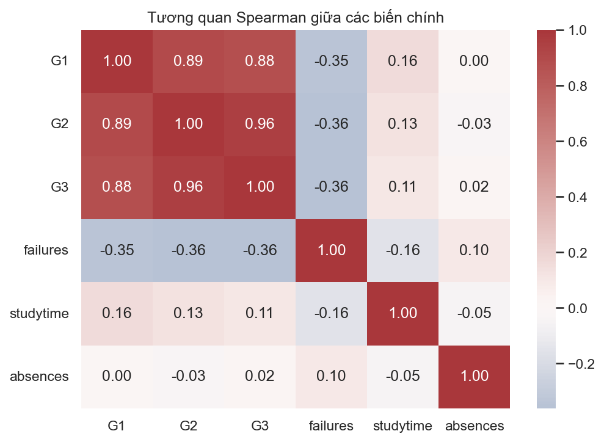
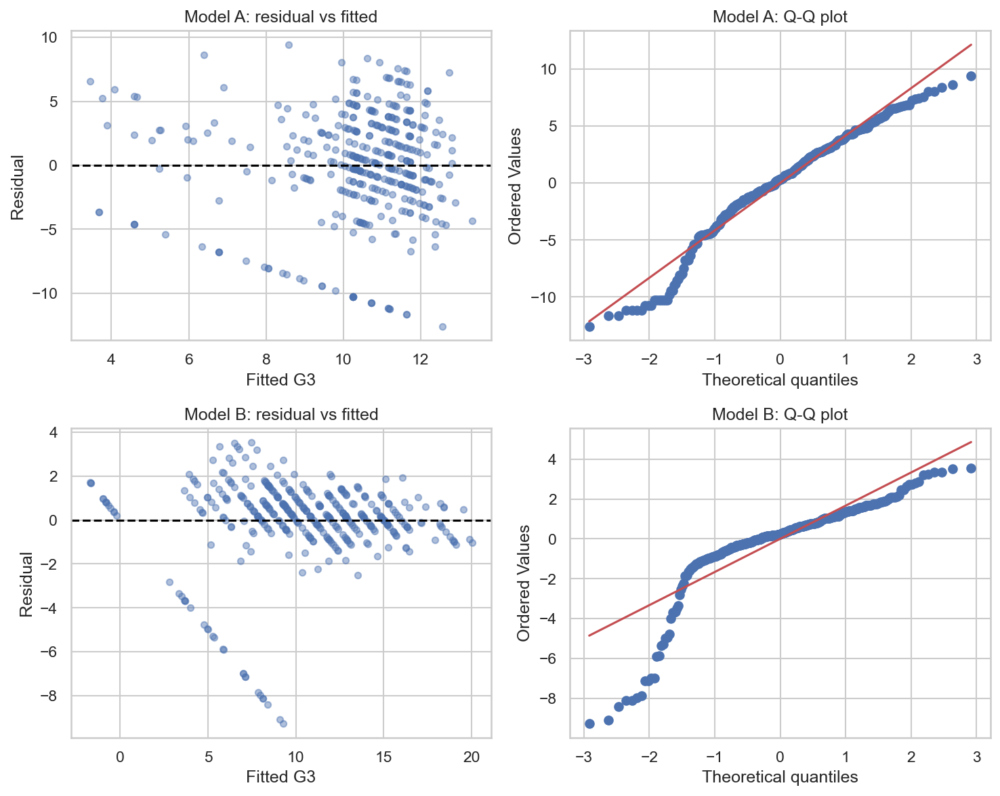
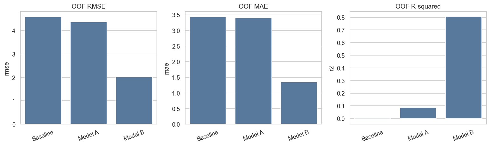
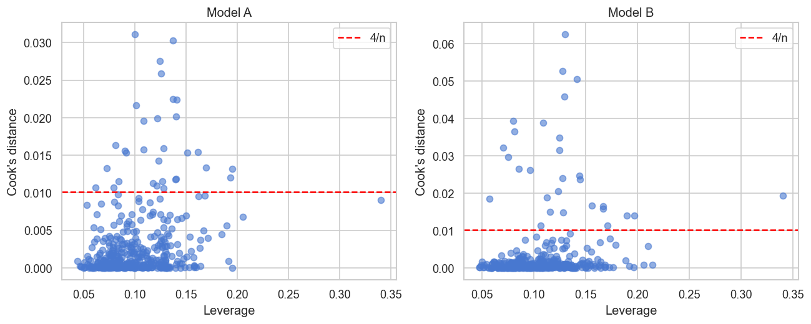

# PHẦN IV — TƯƠNG QUAN VÀ HỒI QUY TUYẾN TÍNH

> **Học phần:** IT2022E — Thống kê ứng dụng và Quy hoạch thực nghiệm.
> **Kế thừa:** [`01_tong_quan_va_pipeline.md`](01_tong_quan_va_pipeline.md) →
> [`03_suy_luan_thong_ke.md`](03_suy_luan_thong_ke.md). *Nguồn:*
> `notebooks/core/03_correlation_and_regression.ipynb`.
>
> File này trả lời **Câu hỏi nghiên cứu Q3**: các biến nền/hành vi có đủ **dự báo sớm** `G3`
> không, và việc bổ sung điểm quá trình `G1`, `G2` thay đổi hiệu năng/cấu trúc liên hệ thế nào?

> 📌 **Phạm vi đặc tả.** Mạch trình bày chính dùng **đặc tả mô hình cốt lõi (`core/03`)**:
> Model A = `failures + studytime + absences + C(school) + C(sex)`; Model B = Model A
> `+ G1 + G2`. Đánh giá ở mức **in-sample** (độ phù hợp, hệ số có điều kiện, residual).
> Các phân tích nâng cao — cross-validation/OOF, HC3, joint Wald, VIF, Breusch–Pagan,
> sensitivity — thuộc **`notebooks/appendix/04_regression.ipynb`** với đặc tả đầy đủ (≈30 biến), được
> giữ làm **PHỤ LỤC KỸ THUẬT** (xem Phụ lục IV-A) và **không** trùng số với mạch chính.

---

## 1. Tương quan giữa các biến chính (§4.4)

### 1.1. Setup và lý do chọn Spearman
Khảo sát liên hệ cặp đôi giữa biến kết quả `G3` và các biến học tập chính (`G1`, `G2`,
`failures`, `studytime`, `absences`). Dùng **Spearman** (hệ số tương quan trên **hạng**) thay
vì Pearson vì: `G3` lệch và có point-mass tại 0, một số biến là **thứ bậc/đếm**, và Spearman
**bền** với quan hệ phi tuyến đơn điệu và outlier.

### 1.2. Kết quả

| Cặp với `G3` | Spearman rho | Diễn giải nhanh |
|---|---:|---|
| `G2` | **0,957** | Gần như trùng thứ hạng với `G3` |
| `G1` | **0,878** | Rất cao |
| `failures` | **−0,361** | Càng nhiều lần trượt, điểm càng thấp |
| `studytime` | 0,105 | Dương rất yếu |
| `absences` | ≈ 0 (0,018) | Gần như không liên hệ tuyến tính đơn điệu |

**Hình 1.** Tương quan Spearman giữa `G1`, `G2`, `G3`, `failures`, `studytime`, `absences`.

### 1.3. Diễn giải và hệ quả cho mô hình hóa
- `G2`↔`G3` cực cao (0,957) là **hợp lý** vì hai điểm đo gần nhau trong cùng môn học; `G1` cũng
  rất cao. Nhưng điều này nghĩa là mô hình dựa vào `G1/G2` **chỉ khả dụng ở thời điểm muộn** —
  không phù hợp cho mọi mục tiêu **can thiệp sớm**.
- `failures` là biến nền có liên hệ rõ nhất với `G3` (âm, vừa).
- `absences` gần như **không** liên hệ đơn điệu với `G3` (nhất quán với H9 exploratory ở
  phần III).
- `G1`, `G2` tương quan cao với nhau → cảnh báo **đa cộng tuyến** tiềm năng khi cùng vào mô
  hình (kiểm tra VIF ở Phụ lục IV-A).

---

## 2. Thí nghiệm so sánh hai mô hình hồi quy (§4.5)

### 2.1. Lý do thực hiện thí nghiệm
So sánh **hai đặc tả** (không và có `G1/G2`) để trả lời Q3 ở ba khía cạnh:
1. **Khả năng giải thích của biến nền/hành vi:** Model A cho biết các thông tin có sẵn **sớm**
   giải thích được bao nhiêu biến thiên `G3`.
2. **Đóng góp của điểm quá trình:** chênh lệch A→B cho thấy `G1/G2` bổ sung bao nhiêu — nhưng
   đây là predictor **target-proximal** (rất gần outcome) nên chủ yếu phục vụ **dự báo muộn**.
3. **Cấu trúc liên hệ có điều kiện:** quan sát hệ số `failures` thay đổi ra sao khi thêm
   `G1/G2` giúp hiểu phần thông tin **chia sẻ** giữa các biến.

> Lưu ý: R² in-sample **đánh giá độ khớp**, không phải khả năng dự báo ngoài mẫu. Đánh giá dự
> báo bằng cross-validation được đặt ở **Phụ lục IV-A** để giữ mạch chính gọn.

### 2.2. Quy trình thực hiện (các bước, đặc tả core/03)
1. Định nghĩa hai công thức Model A và Model B (mục 2.3).
2. **Fit OLS** cả hai trên toàn bộ 395 quan sát (giữ `G3=0`).
3. So sánh **độ phù hợp**: R², adjusted R², RMSE in-sample.
4. Trích **bảng hệ số** kèm khoảng tin cậy 95% và p-value cho **mọi** term.
5. **Diễn giải hệ số** như association có điều kiện; so sánh thay đổi A→B.
6. **Kiểm tra residual** (residual-vs-fitted, Q-Q) để soi giả định OLS.

### 2.3. Setup
- **Model A** = `G3 ~ failures + studytime + absences + C(school) + C(sex)` — chỉ thông tin
  nền/hành vi, **không** `G1/G2` → mục tiêu **nhận diện sớm**.
- **Model B** = Model A `+ G1 + G2` → thêm điểm quá trình, phù hợp **dự báo muộn**.
- Mức tham chiếu (drop-first): `school` baseline = `GP`, `sex` baseline = `F`. Biến thứ bậc
  (`studytime`, `failures`) được coi là **số** → diễn giải hệ số thận trọng.

### 2.4. Giả thuyết & quy tắc
- Với mỗi hệ số: `H0: βⱼ = 0` vs `H1: βⱼ ≠ 0`, kiểm định **t hai phía**; bác bỏ nếu
  `p < 0,05` (tương đương CI 95% **không chứa 0**).
- Các p-value hệ số riêng lẻ là **exploratory**; kết luận theo term bền vững dùng **joint Wald
  + Holm** (Phụ lục IV-A).

### 2.5. Phân tích toán học (công thức đầy đủ)
- **Ước lượng OLS:** `β̂ = (XᵀX)⁻¹Xᵀy`; dự báo `ŷ = Xβ̂`; phần dư `e = y − ŷ`.
- **Phương sai sai số:** `σ̂² = RSS/(n − p)`, `RSS = Σeᵢ²`, `p` = số tham số.
- **Sai số chuẩn & kiểm định hệ số:** `Var(β̂) = σ̂²(XᵀX)⁻¹`; `tⱼ = β̂ⱼ/SE(β̂ⱼ) ~ t(n−p)`;
  CI 95%: `β̂ⱼ ± t(0,975; n−p)·SE(β̂ⱼ)`.
- **Độ phù hợp:** `R² = 1 − SS_res/SS_tot`; `adj R² = 1 − (1−R²)(n−1)/(n−p−1)` (phạt theo `p`);
  `RMSE = √(RSS/n)`.

---

## 3. Kết quả: độ phù hợp in-sample

| Mô hình | Số tham số | R² | Adjusted R² | RMSE in-sample |
|---|---:|---:|---:|---:|
| Model A (không `G1/G2`) | 6 | **0,155** | 0,142 | 4,206 |
| Model B (có `G1/G2`) | 8 | **0,829** | 0,826 | 1,892 |

Thêm `G1/G2` làm R² nhảy từ 0,155 lên 0,829 và RMSE giảm từ 4,21 xuống 1,89 (hơn một nửa).
Adjusted R² gần với R² ở cả hai → việc tăng số tham số không phải nguyên nhân chính của R²
cao. Model A (chỉ biến nền/hành vi) giải thích **hạn chế** biến thiên của `G3`.

---

## 4. Kết quả: hệ số hồi quy chi tiết

### 4.1. Model A — không có `G1/G2`

| Term | Hệ số | CI 95% | p-value | Kết luận |
|---|---:|---|---:|:---:|
| Intercept | 9,322 | [7,847; 10,797] | <1e-29 | — |
| `failures` | **−2,195** | [−2,770; −1,620] | <1e-12 | ✅ |
| `sex`[M] | **1,377** | [0,490; 2,264] | 0,0024 | ✅ |
| `studytime` | 0,468 | [−0,069; 1,006] | 0,087 | — |
| `absences` | 0,041 | [−0,012; 0,094] | 0,130 | — |
| `school`[MS] | −0,110 | [−1,432; 1,211] | 0,870 | — |

**Diễn giải:**
- **`failures`** là yếu tố mạnh nhất: mỗi lần trượt thêm liên quan đến **giảm ~2,2 điểm** `G3`
  (giữ các biến khác cố định).
- **`sex`[M]** dương và có ý nghĩa: nam cao hơn nữ ~1,38 điểm **có điều kiện** trên các biến
  khác. Đáng chú ý: contrast `sex` thô (H1) **rớt** sau Holm ở phần III, nhưng ở đây — sau khi
  điều chỉnh `failures`, `studytime`… — lại có ý nghĩa. Đây là minh họa rõ "**association có
  điều kiện ≠ association thô**".
- `studytime` dương nhưng **CI chứa 0**; `absences` và `school` chưa có bằng chứng trong mô
  hình cốt lõi này.

### 4.2. Model B — bổ sung `G1`, `G2`

| Term | Hệ số | CI 95% | p-value | Kết luận |
|---|---:|---|---:|:---:|
| Intercept | −1,566 | [−2,464; −0,668] | 0,00067 | — |
| **`G2`** | **0,977** | [0,880; 1,073] | <1e-60 | ✅ |
| **`G1`** | 0,146 | [0,036; 0,257] | 0,0094 | ✅ |
| `failures` | −0,291 | [−0,569; −0,014] | 0,039 | ✅ (yếu) |
| `absences` | 0,038 | [0,014; 0,062] | 0,0020 | ✅ (nhỏ) |
| `studytime` | −0,141 | [−0,387; 0,104] | 0,258 | — |
| `sex`[M] | 0,177 | [−0,228; 0,582] | 0,391 | — |
| `school`[MS] | 0,063 | [−0,534; 0,660] | 0,835 | — |

**Diễn giải:**
- **`G2` thống trị:** mỗi điểm `G2` cao hơn liên quan đến gần **1 điểm** `G3` cao hơn (0,977,
  CI [0,880; 1,073]) — predictor mạnh nhất tuyệt đối.
- **`G1`** dương nhỏ (0,146) và có ý nghĩa.
- **`failures` co lại** mạnh: từ −2,195 (Model A) còn −0,291 → phần lớn liên hệ của lịch sử
  trượt môn đã được **`G1/G2` hấp thụ** (điểm quá trình chứa thông tin về thành tích trước).
- **`sex`[M]** mất ý nghĩa (0,177) — cũng bị `G1/G2` hấp thụ.
- **`absences`** trở nên dương nhỏ và "có ý nghĩa" (0,038) **chỉ khi** điều kiện trên `G1/G2`;
  đây có thể là hiệu ứng **suppression**, **không** nên diễn giải nhân quả.

### 4.3. So sánh A → B: điều gì thay đổi khi thêm `G1/G2`?
- R² 0,155 → 0,829; RMSE 4,21 → 1,89.
- Hệ số `failures` co ~7,5 lần; `sex` mất ý nghĩa → các biến nền và điểm quá trình **chia sẻ**
  nhiều thông tin về thành tích.
- Kết luận: `G1/G2` rất mạnh cho **dự báo muộn**, nhưng vì chúng là target-proximal nên Model B
  **không** trả lời câu hỏi **can thiệp sớm** — đó vẫn là địa hạt của Model A.

> Mọi hệ số là **association có điều kiện** trên các biến đã đưa vào, **không** phải tác động
> nhân quả và **không** khẳng định đã kiểm soát đầy đủ confounding (chưa có causal DAG).

---

## 5. Kiểm tra residual và giả định OLS

**Hình 2.** Residual vs fitted (trái) và Q-Q plot (phải) cho Model A và Model B.

- **Residual-vs-fitted:** xuất hiện một **dải chéo** rõ ứng với nhóm `G3=0` (residual giảm
  tuyến tính theo fitted ở các quan sát điểm 0) — dấu hiệu OLS không mô tả tốt **point mass
  tại 0**.
- **Q-Q plot:** đuôi lệch khỏi đường chuẩn, đặc biệt ở **Model B**.
- **Hệ quả:** `G3` bị chặn [0,20] và có khối tại 0 nên giả định tuyến tính + residual chuẩn
  **không** thỏa hoàn hảo. OLS ở đây phù hợp như một **mean model minh bạch** để diễn giải;
  còn đánh giá **dự báo** đáng tin cậy hơn phải dựa trên **out-of-sample metrics** (Phụ lục
  IV-A). Heteroscedasticity và suy diễn bền vững (HC3) cũng được kiểm tra ở phụ lục.

---

## 6. Kết luận phần IV

- `G2` (0,957) và `G1` (0,878) tương quan rất cao với `G3`; `failures` âm vừa (−0,361);
  `absences` ≈ 0.
- **Model cốt lõi không có `G1/G2`** (Model A) giải thích `G3` **hạn chế** (R² 0,155);
  `failures` là biến nổi bật nhất (−2,195), `sex` có ý nghĩa **có điều kiện**.
- **Bổ sung `G1/G2`** (Model B) đẩy R² lên 0,829, do `G2` thống trị; `failures` co lại mạnh →
  thông tin chia sẻ với điểm quá trình. Đây là dự báo **muộn**, không thay can thiệp sớm.
- Residual cho thấy OLS không mô tả tốt point-mass tại 0 → diễn giải hệ số thận trọng.
- Tất cả là **association** trong dữ liệu quan sát hai trường, **không** phải nhân quả.

---

## Phụ lục IV-A — Phân tích hồi quy mở rộng (`notebooks/appendix/04_regression.ipynb`)

> ⚠️ **Phần này là PHỤ LỤC KỸ THUẬT, không thuộc mạch trình bày chính.** Dùng **đặc tả đầy đủ**
> (Model A = toàn bộ ≈30 biến nền/hành vi; Model B = thêm `G1/G2`) để kiểm tra độ bền vững của
> **dự báo ngoài mẫu**. Vì khác đặc tả với mục 2–4, **các con số không trùng** và chỉ nên
> trích dẫn khi cần trả lời câu hỏi về phương pháp nâng cao.

**Quy trình (cross-validation 5-fold).** (1) baseline/A/B; (2) strata `failures==0` vs `>0`,
chia 5-fold StratifiedKFold (shuffle, seed=42); (3) mỗi fold fit preprocessing (OneHot
drop-first + StandardScaler) **chỉ trên train** → fit → dự báo test → gom **OOF predictions**;
(4) aggregate OOF là kết quả chính, fold-wise cho paired (B−A); (5) fit toàn mẫu → HC3 + joint
Wald + Holm; (6) sensitivity; (7) xuất `regression_*` + `reg_*`.

**Cross-validation (out-of-fold):**

| Mô hình | RMSE | MAE | OOF R² |
|---|---:|---:|---:|
| Baseline (trung bình) | 4,585 | 3,435 | −0,004 |
| Model A (đầy đủ) | 4,373 | 3,405 | 0,087 |
| Model B (đầy đủ) | 2,017 | 1,353 | 0,806 |

Model A chỉ nhỉnh hơn baseline (OOF R² 0,087) → biến nền/hành vi **chưa đủ** dự báo sớm chính
xác. Model B vượt trội (0,806) nhờ `G1/G2`, cải thiện nhất quán cả 5 fold (paired RMSE −2,9 đến
−2,0).

**Hình A1.** OOF RMSE/MAE/R² của baseline, Model A, Model B (đặc tả đầy đủ).

**Hình A2.** `G3` quan sát vs dự báo (OOF), tô màu theo trường.

**Inference theo term (HC3 + joint Wald + Holm).** Model A: chỉ `failures` qua Holm
(`p_holm = 0,0010`, hệ số ≈ −1,724, HC3 CI [−2,530; −0,917]). Model B: `G2` rất mạnh
(`p_holm < 1e-77`, ≈ 0,957), `G1` qua Holm ở đặc tả chính nhưng kém ổn định ở sensitivity;
`failures` không còn ý nghĩa riêng (`p_raw = 0,468`).

**Chẩn đoán.** Max VIF 6,06 (A) / 6,15 (B) — cảnh báo nhưng < 10 (không kích hoạt Ridge);
condition number 442,5 / 569,1. Breusch–Pagan: A p=0,165 (không dị phương sai), B p=5,4e-5
(có) → dùng **HC3**. Cook's D > 4/n: 31 (A) / 29 (B) — cờ kiểm tra, không tự loại.

**Hình A3.** Residual diagnostics chi tiết (đặc tả đầy đủ).

**Hình A4.** Cook's distance theo leverage; đường `4/n` là ngưỡng tham khảo.

**Sensitivity (tóm tắt).**

| Phân tích | Model A | Model B | Ghi chú |
|---|---:|---:|---|
| Chính (OOF) | 0,087 | 0,806 | Kết quả phụ lục chính |
| Ordinal-as-category | −0,039 | 0,780 | Tăng bậc tự do không giúp trong mẫu nhỏ |
| `log1p(absences)` | 0,121 | 0,823 | Cải thiện nhẹ |
| Chỉ `G3>0` (n=357) | 0,160 | 0,926 | Point mass tại 0 ảnh hưởng mạnh |
| Per-school `GP`/`MS` | 0,104 / **−0,092** | 0,807 / 0,788 | Model A **âm** ở MS (n=46) |
| Dự báo ngoài [0,20] | 0,5% | 3,8% | Clipping chỉ là sensitivity |

Không sensitivity nào thay thế kết quả chính. Đáng chú ý nhất: Model A có **R² âm tại trường
MS** → random CV chỉ đánh giá học sinh mới trong cùng cấu trúc hai trường, **không** chứng minh
tổng quát hóa sang trường mới.

> **Hình sử dụng:** mạch chính — [reg_course_correlation](../figures/reg_course_correlation.png),
> [reg_course_diagnostics](../figures/reg_course_diagnostics.png); phụ lục —
> [reg_cv_model_comparison](../figures/reg_cv_model_comparison.png),
> [reg_observed_vs_predicted](../figures/reg_observed_vs_predicted.png),
> [reg_residual_diagnostics](../figures/reg_residual_diagnostics.png),
> [reg_influence](../figures/reg_influence.png).
>
> **Tiếp theo:** [`05_quy_hoach_thuc_nghiem.md`](05_quy_hoach_thuc_nghiem.md) — quy hoạch thực
> nghiệm (§5): cỡ mẫu, Monte Carlo power, factorial 2×2.
