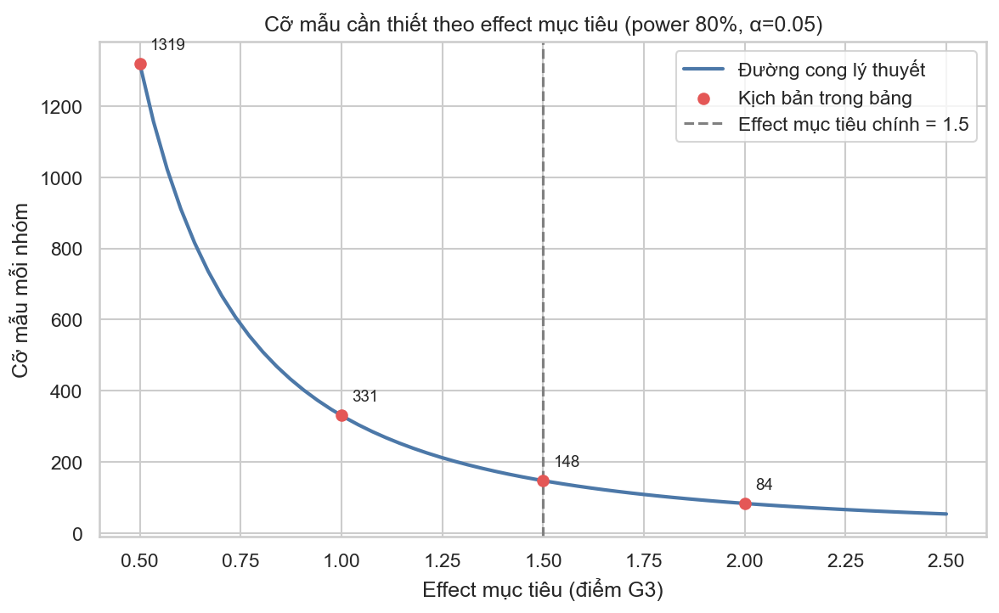
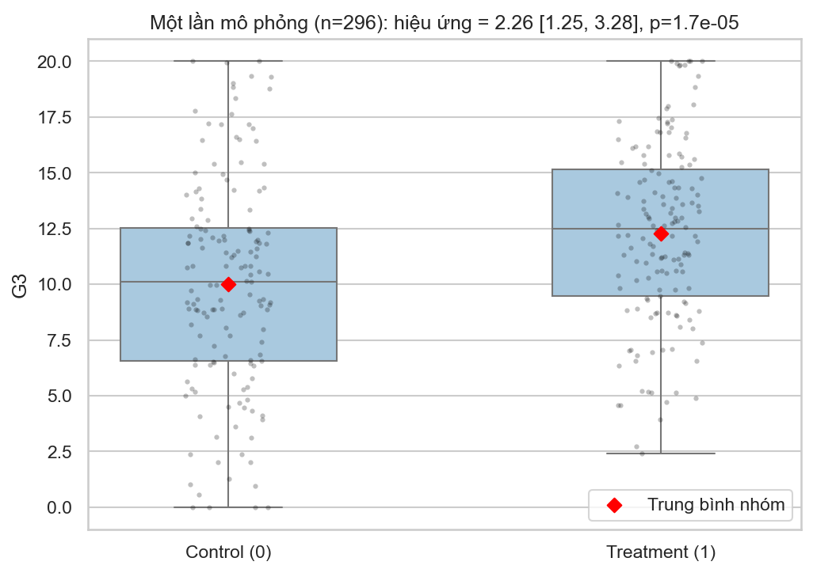
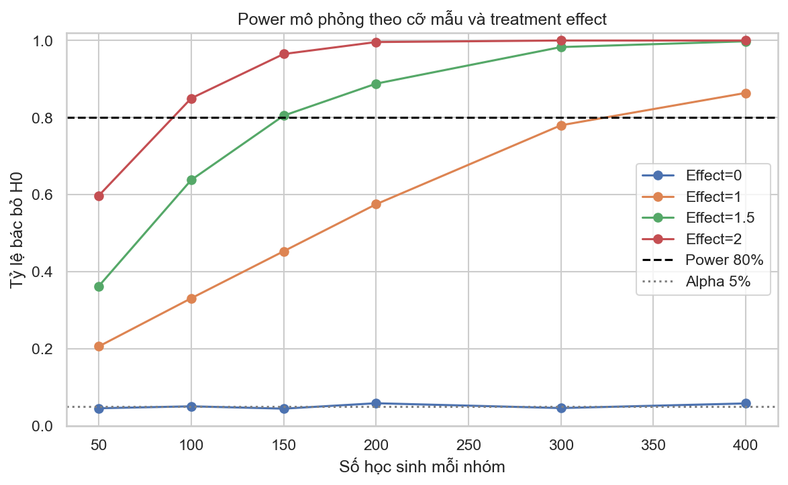
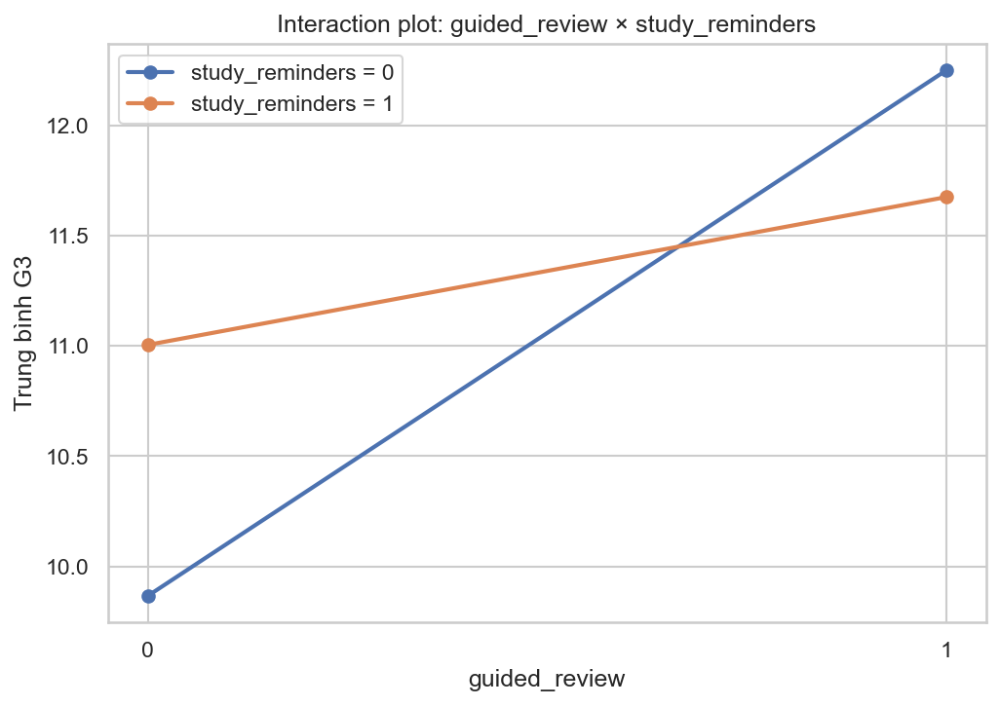

# PHẦN V — QUY HOẠCH THỰC NGHIỆM

> **Học phần:** IT2022E — Thống kê ứng dụng và Quy hoạch thực nghiệm (Chương 7, CLO3–CLO4).
> **Kế thừa:** [`01_tong_quan_va_pipeline.md`](01_tong_quan_va_pipeline.md) →
> [`04_tuong_quan_va_hoi_quy.md`](04_tuong_quan_va_hoi_quy.md), khung
> [`report/OUTLINE.md`](../OUTLINE.md) §5. *Nguồn:*
> `notebooks/core/05_experimental_design.ipynb`; artifact `data/processed/doe_*.csv`.
>
> File này trả lời **Câu hỏi nghiên cứu Q4**: thiết kế một thí nghiệm đánh giá chương trình hỗ
> trợ học tập với treatment, randomization, replication, blocking và cỡ mẫu ra sao.

> 🎯 **Lý do cần thực nghiệm (động cơ chung).** Phần III–IV chỉ dùng **dữ liệu quan sát** →
> không thể biến chênh lệch quan sát thành **tác động can thiệp**. Muốn trả lời nhân quả
> "chương trình hỗ trợ **có làm tăng** `G3` không" thì cần **thí nghiệm ngẫu nhiên**. Vì chưa
> triển khai thực địa, ta **mô phỏng** để (a) tính cỡ mẫu trước khi chạy thật; (b) kiểm chứng
> power/Type I khi outcome bị chặn [0,20]; (c) minh họa factorial.
>
> ⚠️ **Quan trọng (D-016):** treatment effect được **đặt trước theo ý nghĩa thực tiễn**,
> **KHÔNG** sao chép từ chênh lệch quan sát. Dữ liệu UCI chỉ dùng để hiệu chỉnh mức trung bình
> và độ phân tán (`SD ≈ 4,581`).

---

## 1. Khung thiết kế thí nghiệm

| Thành phần | Định nghĩa |
|---|---|
| **Experimental unit** | Một học sinh |
| **Factor / Treatment** | Chương trình ôn tập có hướng dẫn trước kỳ thi cuối kỳ |
| **Treatment levels** | Có chương trình / học thông thường (control) |
| **Response** | `G3`, thang 0–20 |
| **Randomization** | Phân bổ ngẫu nhiên **1:1** trong từng trường |
| **Blocking** | Theo `school` (GP / MS) |
| **Replication** | Nhiều học sinh ở mỗi treatment arm |
| **Primary estimand** | Chênh lệch trung bình `G3` theo phân bổ treatment |
| **Giả thuyết** | `H0: μ_treatment − μ_control = 0` (hai phía) |
| **Mức ý nghĩa / Power** | α = 0,05 ; power = 0,80 |
| **Effect mục tiêu chính** | **+1,5 điểm** `G3` (chọn trước vì có ý nghĩa thực tiễn) |

**Vai trò ba nguyên tắc cốt lõi của Chương 7:**
- **Randomization** — cân bằng các yếu tố gây nhiễu (cả quan sát được và không) **trung bình**
  giữa hai nhóm, là cơ sở để diễn giải nhân quả.
- **Replication** — nhiều đơn vị mỗi arm → giảm standard error, tăng khả năng phát hiện effect.
- **Blocking theo trường** — bảo đảm cả GP và MS đều có đại diện ở treatment lẫn control, giảm
  biến thiên do khác biệt giữa trường.

---

## 2. Thí nghiệm tính cỡ mẫu

- **Lý do:** trước khi triển khai phải biết cần **bao nhiêu học sinh** để đủ power, tránh
  thiết kế **under-powered** (bỏ sót effect thật).
- **Quy trình:** (1) lấy `SD = 4,581` từ dữ liệu quan sát; (2) mỗi effect mục tiêu δ tính
  effect chuẩn hóa `d = δ/SD`; (3) giải cỡ mẫu bằng `TTestIndPower.solve_power(α=0,05,
  power=0,80, ratio=1)`; (4) lập bảng `doe_design_scenarios.csv`.
- **Phân tích toán học:** `d = δ/SD`; cỡ mẫu hai mẫu cân bằng (xấp xỉ chuẩn):
  `n/nhóm ≈ 2(z_{1−α/2} + z_{1−β})² / d²`. Với α=0,05 hai phía (`z=1,96`), power 0,80
  (`z=0,842`): `n/nhóm ≈ 15,70 / d²`.

### Kết quả thí nghiệm

| Effect mục tiêu (δ) | Cohen d = δ/SD | n / nhóm | Tổng mẫu |
|---:|---:|---:|---:|
| 0,5 điểm | 0,1091 | 1.319 | 2.638 |
| 1,0 điểm | 0,2183 | 331 | 662 |
| **1,5 điểm** | 0,3274 | **148** | **296** |
| 2,0 điểm | 0,4365 | 84 | 168 |

**Hình 1.** Cỡ mẫu mỗi nhóm theo effect mục tiêu (power 80%, α=0,05); chấm đỏ là bốn kịch bản
trong bảng. Độ dốc tăng vọt khi effect nhỏ minh họa quan hệ `n ∝ 1/d²`.

### Thảo luận & phân tích
- **Quan hệ phi tuyến `n ∝ 1/d²`:** giảm effect mục tiêu đi một nửa (2,0 → 1,0 điểm) làm cỡ
  mẫu tăng **gần 4 lần** (168 → 662). Đây là lý do effect càng nhỏ càng "đắt".
- **Effect chuẩn hóa nhỏ:** ngay cả +2,0 điểm — một thay đổi đáng kể về điểm — cũng chỉ tương
  ứng `d ≈ 0,44` (effect vừa), vì `SD` của `G3` lớn (4,58). Điều này phản ánh `G3` **biến
  thiên rộng** giữa học sinh.
- **Lựa chọn kịch bản chính:** +1,5 điểm (`d ≈ 0,33`, **296 học sinh**) cân bằng giữa ý nghĩa
  thực tiễn và tính khả thi. Mức +0,5 điểm đòi hỏi tới **2.638** học sinh → một pilot study nhỏ
  gần như chắc chắn **không** đủ power để phát hiện cải thiện nhỏ.

---

## 3. Mô phỏng một thí nghiệm minh họa

- **Quy trình:** với `N/nhóm = 148` (`n_total = 296`): tạo vector phân bổ 0/1 rồi **xáo trộn**
  (randomization); sinh baseline `~N(mean, SD)`; áp đặt effect:
  `outcome = clip(baseline + 1,5 · treatment, 0, 20)`; fit OLS `G3 ~ treatment`.

### Kết quả thí nghiệm (một lần chạy)

| Đại lượng | Giá trị |
|---|---:|
| Effect đặt trước (true) | 1,500 |
| Treatment effect ước lượng | **2,264** |
| 95% CI | [1,245; 3,284] |
| p-value | 1,7e-5 |
| Cỡ mẫu | 148 + 148 = 296 |

**Hình 2.** Một lần mô phỏng (n=296): phân phối `G3` ở Control vs Treatment (kim cương đỏ =
trung bình nhóm). Nhóm treatment cao hơn rõ; hiệu ứng ước lượng 2,26 [1,25; 3,28].

### Thảo luận & phân tích
- **Bác bỏ H0 đúng:** p ≈ 1,7e-5 « 0,05 → kết luận có khác biệt, phù hợp với thực tế effect
  đặt là 1,5 ≠ 0. CI **[1,245; 3,284] chứa giá trị thật 1,5**.
- **Vì sao ước lượng (2,264) lệch khá xa giá trị đặt (1,5)?** Đây là **một realization** ngẫu
  nhiên: với cỡ mẫu vừa phải, ước lượng dao động quanh giá trị thật với độ rộng CI ~2 điểm.
  Một lần chạy có thể "vượt" hoặc "hụt".
- **Liên hệ với power:** thiết kế 148/nhóm được tính để đạt **power 80%** ở effect 1,5 → một
  thí nghiệm đơn lẻ có ~80% xác suất đạt ý nghĩa; lần chạy này nằm trong số đó. Một con số đơn
  lẻ **không** phải bằng chứng đáng tin về độ lớn — cần **nhiều lần lặp** (mục 4) mới đánh giá
  đúng power và độ chệch.

---

## 4. Thí nghiệm Monte Carlo: power và Type I error

- **Lý do:** kiểm chứng công thức cỡ mẫu **lý thuyết** có còn đúng khi outcome bị **chặn
  [0,20]** (floor/ceiling effect), và xác nhận **Type I error** được kiểm soát ở mức α.
- **Quy trình:** với mỗi cặp (effect, n) trong lưới `effect ∈ {0; 1,0; 1,5; 2,0}`,
  `n ∈ {50,…,400}`: lặp **2.000 lần** → sinh control `~N(mean, SD)`, treated
  `~N(mean+effect, SD)` → **clip [0,20]** → Welch t hai phía → đếm tỉ lệ `p < α`
  (`doe_simulation_results.csv`).
- **Phân tích toán học / DGP:** `power = E[bác bỏ H0 | H1]` ≈ tỉ lệ bác bỏ khi effect > 0;
  `Type I = E[bác bỏ H0 | H0]` khi effect = 0.

### Kết quả thí nghiệm — ma trận empirical power (tỉ lệ bác bỏ H0)

| n / nhóm | effect = 0 (Type I) | 1,0 điểm | 1,5 điểm | 2,0 điểm |
|---:|---:|---:|---:|---:|
| 50 | 0,046 | 0,206 | 0,363 | 0,598 |
| 100 | 0,051 | 0,331 | 0,638 | 0,850 |
| **150** | 0,045 | 0,453 | **0,805** | 0,965 |
| 200 | 0,059 | 0,575 | 0,888 | 0,996 |
| 300 | 0,046 | 0,780 | 0,983 | 1,000 |
| 400 | 0,058 | 0,864 | 0,998 | 1,000 |

Effect ước lượng trung bình (cột chọn lọc): với true=1,0 → ~0,96; true=1,5 → ~1,44;
true=2,0 → ~1,92.

**Hình 3.** Empirical power theo cỡ nhóm cho từng mức effect; đường ngang là power 0,80 và α 0,05.

### Thảo luận & phân tích
- **Kiểm soát Type I tốt:** cột effect=0 dao động **0,045–0,059** quanh α = 0,05 ở mọi cỡ mẫu
  → quy trình kiểm định **không** thổi phồng sai lầm loại I, dù outcome bị chặn.
- **Khớp lý thuyết:** ở effect 1,5 và **150/nhóm**, power ≈ **0,805**, sát mức 80% và với phép
  tính lý thuyết 148/nhóm ở mục 2 → mô phỏng **xác nhận** thiết kế.
- **Power tăng theo cả n và effect:** với 1,5 điểm, power leo từ 0,36 (n=50) lên 0,998
  (n=400); effect lớn (2,0) đạt ~0,97 chỉ với 150/nhóm.
- **Độ chệch do clipping (ceiling effect):** effect ước lượng **luôn thấp hơn giá trị đặt**, và
  **độ chệch tăng theo effect** (1,0→−0,04; 1,5→−0,06; 2,0→−0,08). Vì điểm bị chặn ở 20, nhóm
  treated bị "cắt ngọn" nhiều hơn → kéo chênh lệch quan sát xuống. Đây là cảnh báo: trong quần
  thể có nhiều học sinh điểm cao, effect đo được có thể **bị đánh giá thấp**.

---

## 5. Thí nghiệm mở rộng: factorial 2×2

- **Lý do:** minh họa cách ước lượng **đồng thời** hai main effects và **interaction** trong
  **một** thiết kế — hiệu quả hơn chạy hai thí nghiệm riêng — với hai can thiệp đều randomize
  được.
- **Quy trình:** tạo design 2×2 = 4 cell × **80 học sinh** (`guided_review` A × `study_reminders`
  B); sinh `G3 = mean + 1,2·A + 0,6·B + 0,4·(A×B) + ε`, `ε ~ N(0, SD)`, clip [0,20]; fit OLS
  `G3 ~ A * B` (`doe_factorial_results.csv`).
- **Phân tích toán học:** `G3 = β₀ + β_A·A + β_B·B + β_AB·(A×B) + ε`. Mô hình **bão hòa** (4
  tham số cho 4 cell) nên giá trị fit = **trung bình ô quan sát**.

### Kết quả thí nghiệm

**Hệ số ước lượng** (effect đặt trước: β_A=1,2 ; β_B=0,6 ; β_AB=0,4):

| Term | Hệ số ước lượng | p-value | Ý nghĩa (α=5%) |
|---|---:|---:|:---:|
| Intercept (không can thiệp) | 9,866 | <1e-56 | — |
| `guided_review` (A) | **2,386** | 8,1e-4 | ✅ |
| `study_reminders` (B) | 1,140 | 0,107 | — |
| `A × B` (interaction) | −1,715 | 0,087 | — |

**Trung bình `G3` theo ô** (suy ra từ mô hình bão hòa):

| | reminders = 0 | reminders = 1 |
|---|---:|---:|
| **guided = 0** | 9,866 | 11,006 |
| **guided = 1** | 12,252 | 11,677 |

**Hình 4.** Interaction plot: trung bình `G3` theo bốn ô. Hai đường **không song song** (thậm
chí cắt nhau) → có **tương tác**; tác động của guided review lớn hơn rõ khi *không* có reminders.

### Thảo luận & phân tích
- **Đọc hệ số factorial:** `β_A=2,386` là tác động của guided review **khi không có** reminders
  (B=0); `β_B=1,140` là tác động reminders khi không guided; `β_AB=−1,715` cho biết khi có **cả
  hai**, tổng tác động **nhỏ hơn** tổng hai tác động riêng (dấu âm = hai can thiệp **không cộng
  dồn**, có phần chồng lấn).
- **So sánh ước lượng vs giá trị đặt:** chỉ guided review đạt ý nghĩa; reminders và interaction
  **không** qua mức 5% trong lần chạy này, và các ước lượng lệch khá nhiều so với giá trị đặt
  (2,386 vs 1,2; −1,715 vs +0,4). Nguyên nhân: với `SD=4,58` và chỉ 80/ô, **sai số ước lượng
  lớn** → một simulation đơn lẻ rất nhiễu, dấu của interaction thậm chí đảo.
- **Bài học thiết kế:** giá trị của factorial **không** nằm ở con số một lần chạy mà ở **cấu
  trúc**: nó tách được main effects và interaction trong cùng thí nghiệm, tiết kiệm mẫu so với
  hai thí nghiệm riêng. Muốn ước lượng interaction **ổn định**, cần cỡ mẫu/ô lớn hơn nhiều (vì
  kiểm định interaction kém nhạy hơn main effect).

---

## 6. Thảo luận và phân tích tổng hợp các kết quả thí nghiệm

Tổng hợp bốn thí nghiệm (cỡ mẫu, single trial, Monte Carlo, factorial):

1. **Lý thuyết và mô phỏng nhất quán.** Cỡ mẫu lý thuyết (148/nhóm cho 1,5 điểm) được Monte
   Carlo xác nhận (power 0,805 tại 150/nhóm). Quy trình kiểm định kiểm soát Type I ở mức α.
   ⇒ Thiết kế đề xuất là **đáng tin về mặt thống kê**.
2. **Outcome bị chặn gây chệch xuống.** Cả single trial lẫn Monte Carlo cho thấy ảnh hưởng của
   việc `G3` bị giới hạn [0,20]: ước lượng effect trung bình **thấp hơn** giá trị đặt và độ
   chệch tăng theo effect. Khi triển khai thật, nên cân nhắc mô hình phù hợp với outcome bị
   chặn (vd Tobit) nếu kỳ vọng nhiều điểm sát trần.
3. **Effect nhỏ rất đắt.** Quan hệ `n ∝ 1/d²` và `SD` lớn của `G3` nghĩa là phát hiện cải thiện
   nhỏ (0,5 điểm) đòi hỏi hàng nghìn học sinh — một ràng buộc thực tế quan trọng khi lập kế
   hoạch.
4. **Một lần chạy ≠ bằng chứng.** Cả single trial (2,264 vs 1,5) lẫn factorial (2,386 vs 1,2)
   cho thấy point estimate một simulation rất nhiễu. Kết luận về power/độ chệch chỉ đáng tin
   khi **lặp nhiều lần** (Monte Carlo).
5. **Quan sát vs thực nghiệm.** Effect dùng trong mọi tính toán đều **đặt trước theo ý nghĩa
   thực tiễn**, không lấy từ association quan sát ở phần III–IV. Đây chính là khác biệt cốt lõi:
   thiết kế thực nghiệm mới cho phép kết luận **nhân quả**, điều mà dữ liệu quan sát không làm
   được.

---

## 7. Giới hạn của thiết kế đề xuất

- Chương trình treatment mới ở mức **khái niệm**, cần protocol triển khai cụ thể.
- `SD` lấy từ dữ liệu UCI có thể **không khớp** quần thể triển khai mới.
- `G3` bị giới hạn 0–20 → có **floor/ceiling effect** (đã thấy trong mô phỏng).
- **Blocking chỉ theo trường** chưa chắc kiểm soát mọi nguồn biến thiên quan trọng.
- **Noncompliance, contamination, attrition** chưa được đưa vào mô hình cốt lõi.
- Cần xác định trước tiêu chí loại trừ, cách xử lý missing outcome và kế hoạch phân tích
  (pre-registration).

---

## 8. Kết luận phần V

- Đề xuất một **thí nghiệm ngẫu nhiên 1:1, blocking theo trường** để đánh giá chương trình ôn
  tập — đây mới là thiết kế phù hợp cho câu hỏi **nhân quả**, khác hẳn phân tích quan sát ở
  phần III–IV.
- Để phát hiện effect **1,5 điểm** với power 80%, cần khoảng **296 học sinh**; Monte Carlo xác
  nhận power ≈ 0,805 tại 150/nhóm và Type I ≈ 0,05.
- Outcome bị chặn làm effect đo được **chệch xuống**; effect nhỏ đòi hỏi mẫu rất lớn.
- Factorial 2×2 cho phép đánh giá đồng thời hai can thiệp và tương tác, nhưng cần mẫu lớn để
  ước lượng interaction ổn định.
- Mọi kết quả mô phỏng chỉ **minh họa thiết kế**; chúng **không** chứng minh các can thiệp giả
  định thực sự làm tăng `G3`.

> **Hình sử dụng:** [doe_sample_size_curve](../figures/doe_sample_size_curve.png) (§2),
> [doe_single_trial](../figures/doe_single_trial.png) (§3),
> [doe_power_curve](../figures/doe_power_curve.png) (§4),
> [doe_factorial_interaction](../figures/doe_factorial_interaction.png) (§5).
>
> **Tiếp theo:** [`06_sai_so_han_che_va_ket_luan.md`](06_sai_so_han_che_va_ket_luan.md) — sai
> số, selection/measurement/confounding, thảo luận và kết luận chung (§6–§8).
