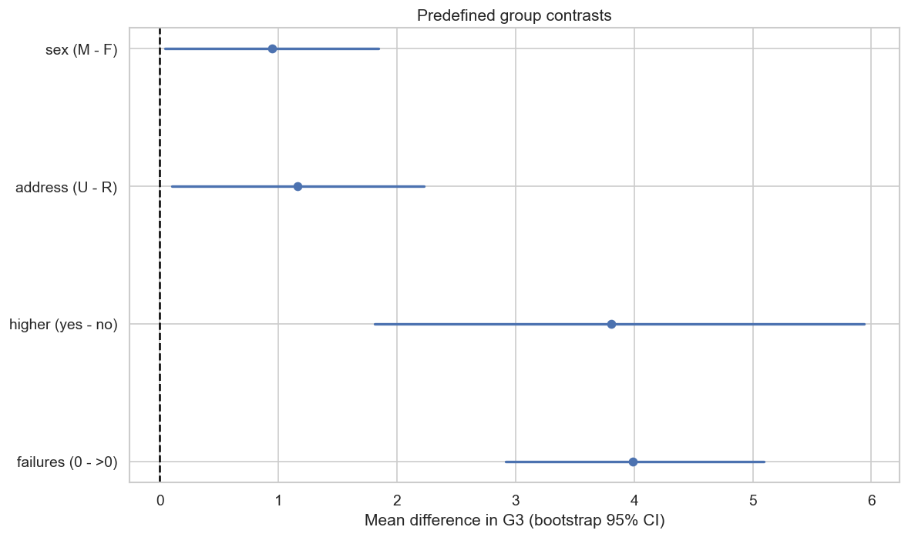
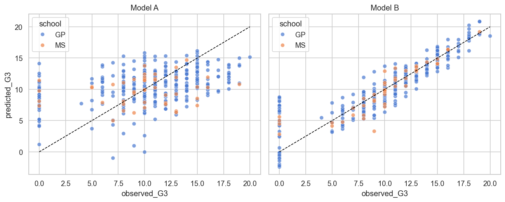
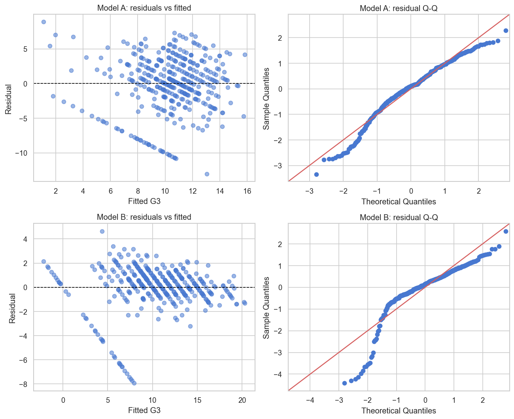

# PHẦN VI — SAI SỐ, HẠN CHẾ, THẢO LUẬN VÀ KẾT LUẬN

> **Học phần:** IT2022E — Thống kê ứng dụng và Quy hoạch thực nghiệm.
> **Kế thừa:** [`01`](01_tong_quan_va_pipeline.md) → [`05`](05_quy_hoach_thuc_nghiem.md). *Nguồn:*
> tổng hợp toàn bộ phân tích + `notebooks/appendix/03_confidence_intervals.ipynb`,
> `notebooks/appendix/04_regression.ipynb`.
>
> File này khép lại báo cáo: tổng hợp **các nguồn sai số và hạn chế**, **thảo luận** ý nghĩa,
> **kết luận** trả lời 4 câu hỏi nghiên cứu, và **tài liệu tham khảo**. Theo quy ước, phần này
> **dùng lại** một số hình chẩn đoán đã có (không sinh hình mới).

---

## 1. Sai số và hạn chế (§6)

Một báo cáo thống kê trung thực phải nêu rõ **giới hạn** của kết quả. Dưới đây là bảy nhóm
sai số/hạn chế, xếp từ lấy mẫu đến thực nghiệm.

### 1.1. Sai số lấy mẫu
Mẫu chỉ có **395 học sinh**; mọi ước lượng sẽ thay đổi nếu lấy một mẫu khác từ cùng quần thể.
**Khoảng tin cậy** biểu diễn một phần độ bất định này. Những **nhóm nhỏ** có standard error
lớn và CI rộng hơn nhiều — rõ nhất là `higher=no` (chỉ n=20): chênh lệch điểm 3,808 nhưng
Welch 95% CI rộng tới [1,509; 6,107].

**Hình 1.** (Dùng lại từ Phần III) CI bootstrap cho bốn contrast — bề rộng CI của `higher`
phản ánh độ bất định lớn do nhóm đối chứng nhỏ.

### 1.2. Selection bias và khả năng khái quát hóa
Dữ liệu chỉ gồm **hai trường**; việc một học sinh có mặt trong dataset **không** phải kết quả
của mẫu ngẫu nhiên toàn quốc. Trường `MS` chỉ có **46** học sinh, và Model A có **OOF R² âm
(−0,092)** khi đánh giá riêng trên nhóm này → hiệu năng có thể khác đáng kể giữa các trường.

**Hình 2.** (Dùng lại từ Phần IV phụ lục) Dự báo OOF tô màu theo trường; random CV chỉ đánh
giá học sinh mới trong **cùng cấu trúc hai trường**, không chứng minh tổng quát hóa sang
trường mới. Kết quả **không** nên khái quát trực tiếp sang trường/quốc gia/thời kỳ khác.

### 1.3. Sai số đo lường
Các biến **tự báo cáo** (`studytime`, `Walc`, `Dalc`, `famrel`, `health`) có thể sai lệch.
Sai số **ngẫu nhiên** thường **làm yếu** mối liên hệ; sai số **có hệ thống** có thể **tạo
hoặc che giấu** association. Việc mã hóa nhiều khái niệm phức tạp thành thang 1–5 cũng làm mất
thông tin. `G3` có thể chịu ảnh hưởng của sai số chấm điểm hoặc khác biệt đề thi; nếu một
treatment trong thí nghiệm tác động đến cách chấm hoặc khả năng dự thi, outcome còn có nguy cơ
**measurement bias** hoặc **missing-not-at-random**.

### 1.4. Confounding
Năng lực ban đầu, động lực, thu nhập gia đình, chất lượng giáo viên, môi trường học tập… có
thể **đồng thời** liên quan đến predictors và `G3`. Hồi quy chỉ điều chỉnh cho các biến **đã
quan sát và đưa vào** mô hình. Project **không** có causal DAG → không phân loại được
confounder / mediator / collider, và **không** bảo đảm đã kiểm soát đầy đủ confounding. Đây là
lý do mọi hệ số được trình bày như **association có điều kiện**, không phải tác động nhân quả.

### 1.5. Sai số mô hình (model misspecification)
OLS giả định quan hệ **tuyến tính** và residual có cấu trúc phù hợp. `G3` bị **chặn [0,20]** và
có **point mass tại 0**, nên mô hình tuyến tính không mô tả hoàn hảo phân phối.
**Heteroscedasticity** xuất hiện rõ ở Model B (Breusch–Pagan p=5,4e-5). **HC3** giúp standard
error bền vững hơn nhưng **không** sửa được misspecification (phi tuyến, point-mass, omitted
variables).

**Hình 3.** (Dùng lại từ Phần IV phụ lục) Dải chéo tại `G3=0` và đuôi Q-Q lệch cho thấy OLS
không mô tả tốt outcome bị chặn — nên kết luận **dự báo** dựa trên OOF metrics, còn diễn giải
hệ số thận trọng.

### 1.6. Multiple testing và phân tích exploratory
Chạy nhiều kiểm định làm tăng xác suất có ít nhất một **dương tính giả**. Project dùng **Holm
correction** cho 10 giả thuyết chính và **joint Wald + Holm** cho hồi quy. **H9** (`absences`)
hình thành sau EDA nên chỉ có vai trò **exploratory**. Các p-value hệ số riêng lẻ **không**
được dùng để chọn biến hay dựng câu chuyện nhân quả sau khi đã xem dữ liệu.

### 1.7. Sai số thực nghiệm
Trong thí nghiệm đề xuất, biến thiên cá nhân, **độ tuân thủ** (compliance), **contamination**
giữa các nhóm, **attrition** và sai số chấm điểm đều có thể làm tăng experimental error.
**Randomization** giảm confounding **trung bình** nhưng **không** bảo đảm hai nhóm cân bằng
hoàn hảo trong mẫu nhỏ; cần **replication**, **blocking** và **protocol chuẩn hóa** để kiểm
soát các nguồn sai số này.

---

## 2. Thảo luận (§7)

**`failures` và `higher` là phát hiện nổi bật của dữ liệu quan sát**, trong đó `failures` có
effect size omnibus lớn nhất. Tuy nhiên, số lần trượt môn vừa phản ánh năng lực trước đó, vừa
chịu ảnh hưởng của động lực, hoàn cảnh và chính sách nhà trường → phù hợp như một **dấu hiệu
nhận diện rủi ro** hơn là một **nguyên nhân can thiệp** trực tiếp.

**`higher=yes` có chênh lệch lớn nhưng nhóm đối chứng rất nhỏ** (n=20). Biến này có thể phản
ánh aspiration/động lực, cũng có thể là **kết quả** của thành tích trước đó. Một chương trình
thực tế không thể đơn giản "gán" định hướng học đại học và kỳ vọng thu được effect 3,808 điểm.

**Model A cho thấy dự báo sớm là bài toán khó**: dữ liệu nền/hành vi hiện có chỉ hỗ trợ dự báo
hạn chế (OOF R² 0,087). **Model B** đạt hiệu năng cao nhờ `G1/G2` (đặc biệt `G2`) — hữu ích cho
dự báo **gần kỳ thi**, nhưng thời điểm nhận diện có thể **quá muộn** cho can thiệp dài hạn.

**Khác biệt giữa phân tích quan sát và quy hoạch thực nghiệm là trọng tâm của báo cáo.** Phân
tích quan sát tạo bằng chứng về **association** và giúp xác định nhóm/vấn đề đáng quan tâm; chỉ
**thí nghiệm ngẫu nhiên** mới phù hợp để đánh giá **tác động** của một chương trình cụ thể.
Effect trong tính cỡ mẫu phải dựa trên mức cải thiện **có ý nghĩa thực tiễn**, không sao chép
từ chênh lệch quan sát.

Việc báo cáo **effect size, CI, kết quả ngoài mẫu và sensitivity** giúp tránh phụ thuộc hoàn
toàn vào p-value: một kết quả có ý nghĩa thống kê nhưng effect nhỏ (vd `Fedu`, ε²≈0,027) có thể
không quan trọng thực tế; ngược lại một effect đáng quan tâm có thể không đạt ý nghĩa do mẫu
nhỏ (vd contrast `higher` mất cân bằng).

---

## 3. Kết luận (§8)

Báo cáo đã áp dụng một quy trình thống kê hoàn chỉnh từ chuẩn bị dữ liệu đến thiết kế thực
nghiệm. Bốn câu hỏi nghiên cứu được trả lời như sau:

1. **Q1 — Mô tả:** mẫu gồm **395 học sinh**, `G3` trung bình **10,415**, 95% CI **[9,962;
   10,868]**; phân phối có **9,62%** giá trị bằng 0.
2. **Q2 — Liên hệ:** sau Holm correction, **`higher`, `failures`, `Medu`, `Fedu`** còn có ý
   nghĩa thống kê. Đây là **association** trong dữ liệu quan sát, không phải nhân quả.
3. **Q3 — Dự báo:** mô hình **không** có `G1/G2` dự báo sớm hạn chế; **bổ sung điểm quá trình**
   làm OOF R² tăng từ **0,087 lên 0,806**, với `G2` là predictor nổi bật nhất.
4. **Q4 — Thực nghiệm:** một thí nghiệm ngẫu nhiên **1:1, blocking theo trường** cần khoảng
   **296 học sinh** để phát hiện effect **1,5 điểm** với power 80% (Monte Carlo xác nhận ≈0,805
   tại 150/nhóm).

**Đóng góp chính** của project không phải khẳng định một nguyên nhân duy nhất của thành tích
học tập, mà là **minh họa cách kết hợp** thống kê mô tả, suy luận, hồi quy, đánh giá sai số và
quy hoạch thực nghiệm trong một quy trình **có thể tái lập**.

**Hướng phát triển tiếp theo:**
- Thử mô hình phù hợp hơn với outcome **bị chặn** (vd Tobit, mô hình cho point-mass tại 0).
- Thu thập dữ liệu từ **nhiều trường** để cải thiện khả năng khái quát hóa.
- Cải thiện **thang đo hành vi** (đa mục thay vì single-item) để đánh giá được độ tin cậy.
- Triển khai **pilot study** để ước lượng thực tế hơn về phương sai, compliance và attrition
  trước khi chạy thí nghiệm quy mô lớn.

---

## 4. Tài liệu tham khảo (§9)

1. Cortez, P., & Silva, A. M. G. (2008). *Using Data Mining to Predict Secondary School Student
   Performance*. Proceedings of FUture Business TEChnology Conference.
2. UCI Machine Learning Repository. *Student Performance Dataset*.
   <https://archive.ics.uci.edu/dataset/320/student+performance>
3. Walpole, R. E., Myers, R. H., Myers, S. L., & Ye, K. *Probability and Statistics for
   Engineers and Scientists*, 8th ed. Pearson, 2007.
4. Trosset, M. W. *An Introduction to Statistical Inference and Data Analysis with R*. CRC
   Press, 2009.
5. Mason, R. L., Gunst, R. F., & Hess, J. L. *Statistical Design and Analysis of Experiments*.
6. Slide bài giảng học phần IT2022E — Thống kê ứng dụng và Quy hoạch thực nghiệm.

---

> **Hình sử dụng (đều dùng lại, không sinh mới):**
> [ci_group_differences](../figures/ci_group_differences.png) (§1.1),
> [reg_observed_vs_predicted](../figures/reg_observed_vs_predicted.png) (§1.2),
> [reg_residual_diagnostics](../figures/reg_residual_diagnostics.png) (§1.5).
>
> **Kết thúc bộ báo cáo chi tiết** (file 01–06). Mạch trình bày chính bám đề cương IT2022E;
> các phân tích nâng cao được giữ ở phụ lục kỹ thuật.
